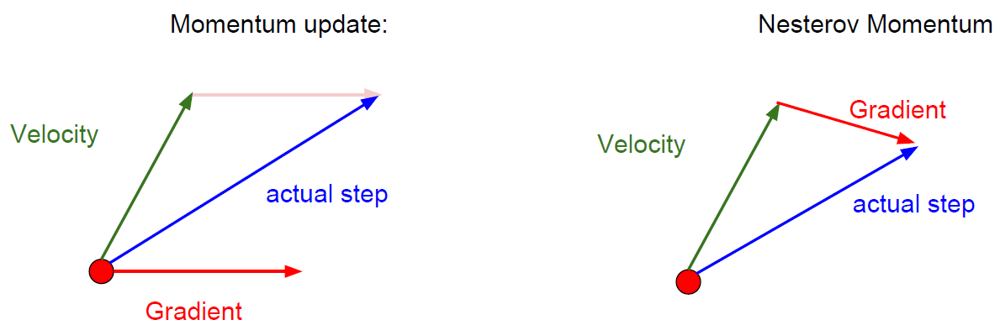

## 神经网络中常用的优化方法

### 梯度下降法的三种形式BGD、SGD以及MBGD

  - [批量梯度下降法BGD](https://www.cnblogs.com/maybe2030/p/5089753.html#_label0)
  - [随机梯度下降法SGD](https://www.cnblogs.com/maybe2030/p/5089753.html#_label0)
  - [小批量梯度下降法MBGD](https://www.cnblogs.com/maybe2030/p/5089753.html#_label0)

1. **批量梯度下降法**（Batch Gradient Descent，简称BGD）是梯度下降法最原始的形式，它的具体思路是在更新每一参数时都使用所有的样本来进行更新。
   - 优点：全局最优解；易于并行实现；
   - 缺点：当样本数目很多时，训练过程会很慢。
2. **随机梯度下降法SGD**：由于批量梯度下降法在更新每一个参数时，都需要所有的训练样本，所以训练过程会随着样本数量的加大而变得异常的缓慢。随机梯度下降法（Stochastic Gradient Descent，简称SGD）正是为了解决批量梯度下降法这一弊端而提出的。
    - 优点：训练速度快；
    - 缺点：准确度下降，并不是全局最优；不易于并行实现。
3. **小批量梯度下降法MBGD**：有上述的两种梯度下降法可以看出，其各自均有优缺点，那么能不能在两种方法的性能之间取得一个折衷呢？即，算法的训练过程比较快，而且也要保证最终参数训练的准确率，而这正是小批量梯度下降法（Mini-batch Gradient Descent，简称MBGD）的初衷。

### 总结
   - Batch gradient descent: Use all examples in each iteration； 
   - Stochastic gradient descent: Use 1 example in each iteration；
   - Mini-batch gradient descent: Use b examples in each iteration.

### SGD存在的问题：
   - 各方向的梯度差较大，进展缓慢。
   - 易陷入局部极小点
   - 鞍点在高维空间中更为常见
   - 噪声严重

### SGD改进及变种

#### 1：SGD + Momentum：
   
 > 引入速度的概念：引入“速度”作为梯度的运行平均值；通常$\rho$ = 0.9 or 0.99。有效解决了SGD的噪声、、极小点、速度和鞍点问题


SGD迭代方式：


$x_{t+1}=x_{t}-\alpha\nablaf\left(x_{t}\right)$


**代码：**


```
while True:
    dx = compute_gradient(x)
    x += learning_rate * dx
```
SGD + Momentum迭代方式：


$\begin{aligned} v_{t+1} &=\rho v_{t}+\nabla f\left(x_{t}\right) \\ x_{t+1} &=x_{t}-\alpha v_{t+1} \end{aligned}$


**代码：**
```
vx = 0
while True:
    dx = compute_gradient(x)
    vx = rho * vx + dx
    x += learning_rate * vx
```
#### 2：Nesterov Momentum

> 理论上对于凸函数它能得到更好的收敛，在实践中也确实比标准动量表现更好一些。

Nesterov Momentum迭代方式


$\begin{aligned} v_{t+1} &=\rho v_{t}-\alpha \nabla f\left(x_{t}+\rho v_{t}\right) \\ x_{t+1} &=x_{t}+v_{t+1} \end{aligned}$


**代码：**

```
while True：
    dx = compute_gradient(x)
    old_v = v
    v = rho * v - learning_rate * dx
    x += -rho * old_v + (1 + rho) * v
```



#### 3：Adagrad

> 是一个适应性学习率算法。

```
grad_squared = 0
while True:
    dx = compute_gradient(x)
    grad_squared += dx * dx
    x -= learning_rate *dx / (np.sqrt(grad_squared) + 1e-7)
```

使用了Adagrad，步长会变得越来越小，因为一直在随时间更新梯度平方的估计值，所以这个估计值，一直随时间单调递增，会导致学习率随着时间越来越小。

- **优点**：在凸函数中Adagrad效果很好，当接近极点时，会逐渐的慢下来，最后到达收敛。
- **缺点**：在非凸函数时，事情会变得复杂，当到达一个局部极值点时，使用Adagrad会被困在这里，从而使训练过程无法继续。

#### 4：RMSprop

**RMSProp**是一个非常高效，但没有公开发表的适应性学习率方法。这个方法用一种很简单的方式修改了Adagrad方法，让它不那么激进，单调地降低了学习率。具体说来，就是它使用了一个梯度平方的滑动平均。

**代码**
```
grad_squared = 0
while True:
    dx = compute_gradient(x)
    grad_squared = decay_rate * grad_squared + (1 - decay_rate) * dx * dx
    x -= learning_rate * dx / (np.sqrt(grad_squared) + 1e-7)
```

#### 5: ADAM

看起来想视RMSProp的动量版本

**代码**
```
first_moment = 0
second_moment = 0
while True:
    dx = compute_gradient(x)
    first_moment = beta1 * first_moment + (1 - beta1) * dx
    second_moment = beta2 * second_moment + (1 - beta2) * dx * dx        # Momentum
    x -= learning_rate * first_moment / (np.sqrt(second_moment) + 1e-7)  # AdaGrad / RMSProp
```

Adam完整的算法包含偏置项，以避免开始时出现很大的步长。


```
first_moment = 0
second_moment = 0
for t in range(num_iteration):
    dx = compute_gradient(x)
    first_moment = beta1 * first_moment + (1 - beta1) * dx
    second_moment = beta2 * second_moment + (1 - beta2) * dx * dx        # Momentum
    first_unbias = first_moment / (1 - beta1 ** t)
    second_unbias = second_moment / (1 - beta2 ** t)                     # bias correction
    x -= learning_rate * first_moment / (np.sqrt(second_moment) + 1e-7)  # AdaGrad / RMSProp
```
> Adam的超参数一般设置为```beta1 = 0.9，beta2 = 0.999，learning_rate = 1e-3 或者5e-4```，对任何模型来说，都是一个不错的开始

### 学习率衰减的方法

#### 1：指数衰减：
$\alpha=\alpha_{0} e^{-k t}$

#### 2：1/t 衰减
$\alpha=\alpha_{0} /(1+k t)$


### 二阶优化方法

1. 利用梯度和Hessian函数形成二次逼近
2. 求近似的最小值
    - 优点：不需要学习率，没有超参数
    - 缺点：计算量庞大
#### L-BFGS方法
通常在全批次、确定性模式下工作得很好。如果你有一个单一的，确定性的f(x)那么L-BFGS可能会很好地工作。不能很好地转移到小批量设置。给了坏的结果。将L-BFGS应用于大规模随机环境是当前研究的热点。

在深度学习和卷积神经网络中，使用L-BFGS之类的二阶方法并不常见。相反，基于（Nesterov的）动量更新的各种随机梯度下降方法更加常用，因为它们更加简单且容易扩展。

### 模型集成
- 训练多个独立模型
- 在测试时平均他们的结果一般会有2%额外表现

### 总结：

- 在大多数情况下，Adam是一个很好的默认选择
- 如果你可以做完整的批量更新，那么试试L-BFGS(不要忘记禁用所有噪音源)
