## SSD算法原理

### 简介
- Single Shot MultiBox Detector (One-stage方法)
  - Wei Liu在2016年提出
  - 直接回归目标类别和位置
  - 不同尺度的特征如上进行预测
  - 端到端的训练
  - 图像的分辨率比较低，也能保证检测的精度
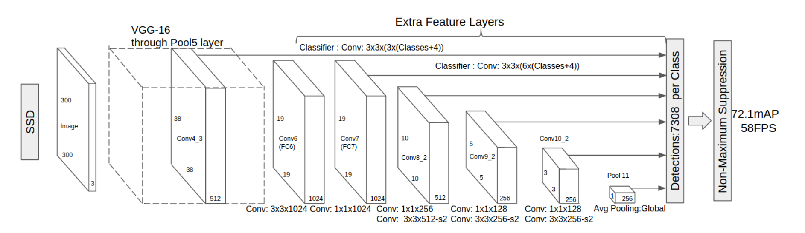

- 主干网络：VGGNet
- 多尺度Feature Map预测
  - 会对不同的六个尺寸分别预测 
- Default bounding boxes的类别分数、偏移量

#### 主干网络介绍
- VGG、ResNet、MobileNets等，各种卷积神经网络
- 将VGG最后两个FC改为卷积，并增加4个卷积层

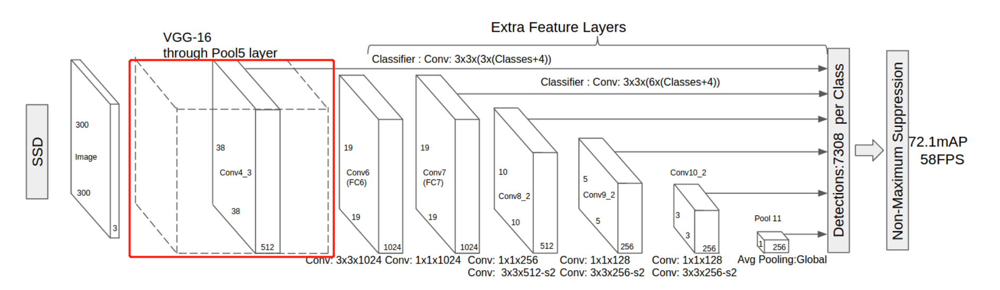

#### 多尺度Feature Map预测
- 不同层的feature map
- Prior box：类别概率和坐标(x,y,w,h)
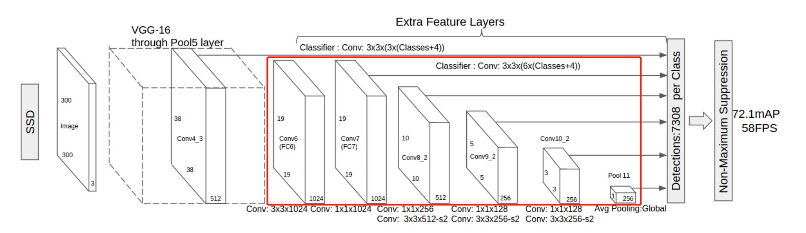
  - 不同尺度的方法通常采用pooling的方法进行下采样。
  - 对于每一个尺度的Feature map输入到相应的预测网络中 

#### Prior Box Layer
- m×n维的feature map，每个点作为一个cell，共有m×n个cell
- 每个cell上生成固定scale和aspect ratio的box
  - 假设一个feature map有m×n个cell，每个ce'l'l对应k个default box，每个default box预测c个类别score和4个offset(偏移值，指x,y,w,h)
  - (c+4) * k * m *n 个输出
- Scale：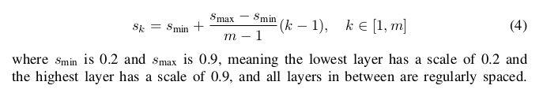
  - Aspect ratio：
$$
a_{r} \in\left\{1,2,3, \frac{1}{2}, \frac{1}{3}\right\}
$$
  - 宽：$w_{k}^{a}=s_{k} \sqrt{a_{r}}$
  - 高：$h_{k}^{a}=s_{k} / \sqrt{a_{r}}$
  - aspect ratio = 1，增加一种scale的default box：$s_{k}^{\prime}=\sqrt{s_{k} \cdot s_{k+1}}$
  - 每个feature map cell定义6种default box
  - shape数量越多，效果越好
  - 原理和Anchor基本一致
  - 38×38×4 + 19×19×6 + 10×10×6 + 5×5×6 + 3×3×4 + 1×1×4 = 8372个prior box
- 每一个feature map cell不是k个default box都取
  - prior box与GT box(真值)做匹配，IOU > 阈值为正样本
  - 训练：确保prior box的分类准确且尽可能回归到GT box 

#### 样本构造：
- 正样本：
  - 从GT box出发，找到最匹配的prior box放入候选正样本集
  - 从 prior box集出发，寻找与GT box满足IOU > 0.5的最大prior box放入候选正样本集
- 负样本：
  - [x] 难例挖掘：可以使用指定的阈值照道难例。
    -  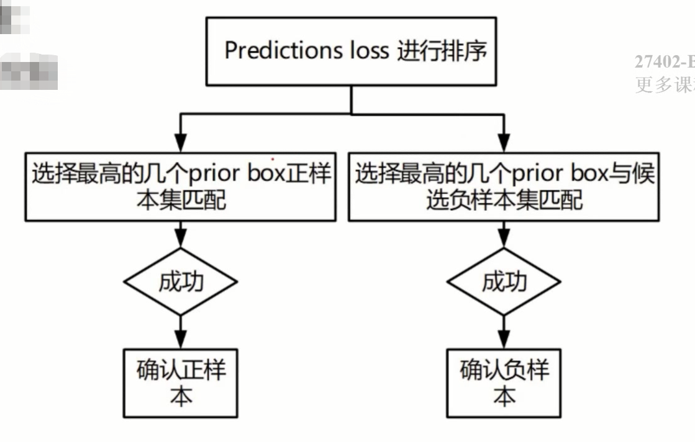
  - [x] 正负样本比1:3

#### 数据增强
- 随机采样采样多个path，与物体之间最小的jaccard overlap(即IOU)为：0.1，0.3，0.5，0.7与0.9
- 采样的path比例使[0.3,1.0],aspect ratio在0.5或2
- GT box中心在采样path中且面积大于1
- Resize到固定的大小
- 以0.5的概率随机的水平翻转

#### 损失函数
- 分类loss + 回归loss
  - 分类loss：Softmax loss
  - 回归loss：smooth L1 loss
  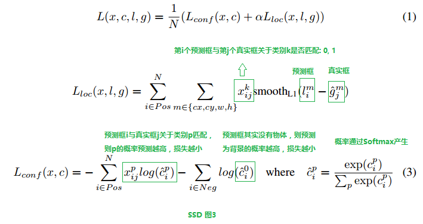 
  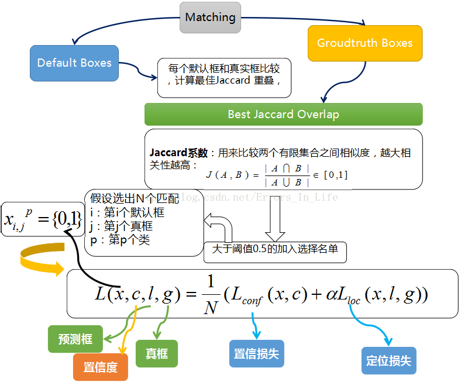

#### 小策略
- 数据增强对于结果的提升非常明显
- 使用更多的feature maps对结果提升更大
- 使用更多的default boxes，对结果也越好
- Atrous使得SSD又好又快
  - Atrous：指空洞卷积 

#### 基本框架
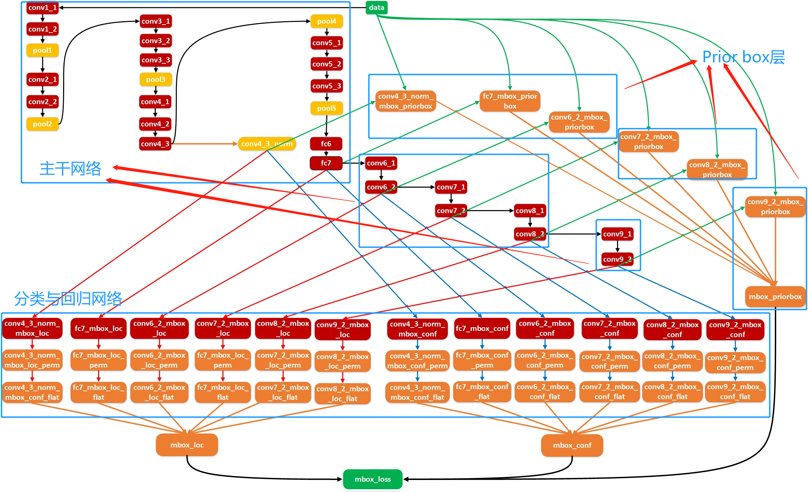

#### 使用细节
- 数据增强时，需要关注Crop采样大小
- 需要注意多任务网络权重
- 正负样本一般时1:3
- 难例挖掘方式默认只取64个predictions loss来从中寻取负样本

#### SSD系列算法优化及扩展
1. 主干网络的优化。始用ResNet，GoogleNet等更优秀的主干网络
2. Prior Box Layer层的优化
   - DSSD，DSOD，FSSD，RSSD

 #### DSSD：
 - SSD算法对小目标不够鲁棒的最主要的原因是浅层的Feature map的表征能力不够强
   - 加入上下文信息
   - 更好的基础网络(**ResNet**)和**Deconvolution**层(反卷积)，skip连接来给钱曾feature map更好的表征能力
 -  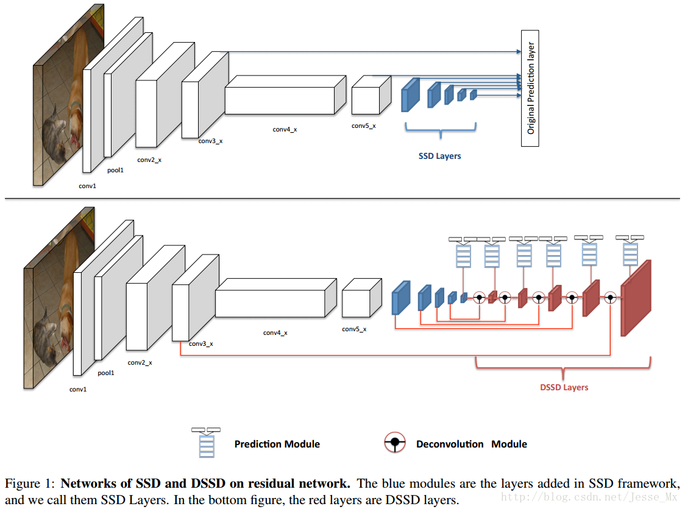

#### DSOD：
- 2017年的ICCV2017提出
- DSOD可以从0开始训练数据，不需要预训练模型，而且效果可以和Fine-tune的模型媲美
- SSD + DenseNet = DSOD
    思想：
  - 可以从零开始训练得到一个好的目标检测网络
  - 如果可以，设计这样的网络有没有什么原则可以遵守?
- 预训练模型的优点：
   - 开源模型多，可以直接用于目标检测
   - 可以快速得到最终的模型，需要训练的数据也相对较少
- 预训练模型的缺点：
  - 预训练模型大，参数太多，模型结构灵活性差，难以改变网络结构，计算量也大，限制其应用场合
  - 分类和检测任务的损失函数和类别分布是不一样的，优化空间存在差异
  - 尽管微调可以减少不同目标类别分布的差异性，但是查一太大时，微调效果依然不理想  
##### DSOD设计原则
- 基于候选区域提取的方法无法从零开始训练，不收敛，只有propostal-free方法可以从0开始训练并收敛(ROI Pooling)
- DenseNet中更多的skip connections(跳连结构)实现supervised signals传递
- 增加dense blocks数量区别原先的固定数量
- Stem Block优化(3个3×3卷积层和1个2×2最大池化层)
- 6个尺度特征图进行目标检测，再融合(如何利用特征图)

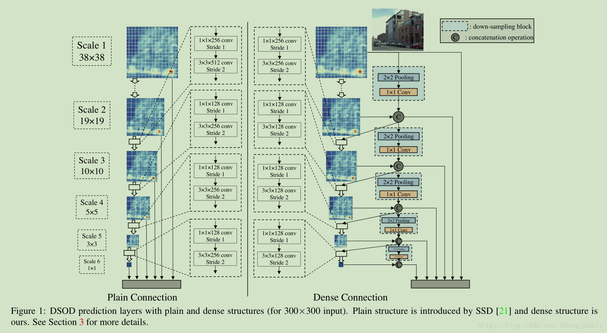

#### FSSD设计原则
- 借鉴FPN的思想，重构了一组pyramid feature map(金字塔特征图)，使得算法的精度有了明显的提升，速度也没有下降
  - 把网络中某些feature调整为同一size再concat，得到一个像素层，以此层为base layer来生成pyramid feature map(
  - Feature Fusion Modeule(特征融合模块)
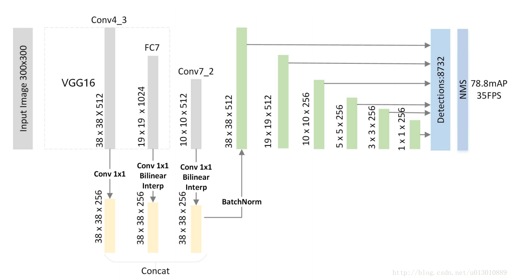

#### RSSD设计原则
- rainbow concatenation方式(pooling + deconvolution)融合不同层的特征，在增加不同层之间feature map关系的同时也增加了不同曾的feature mao个数
- 这种融合方式不仅解决了传统SSD算法存在的重复框问题，同时一定程度上解决了small object的检测问题
 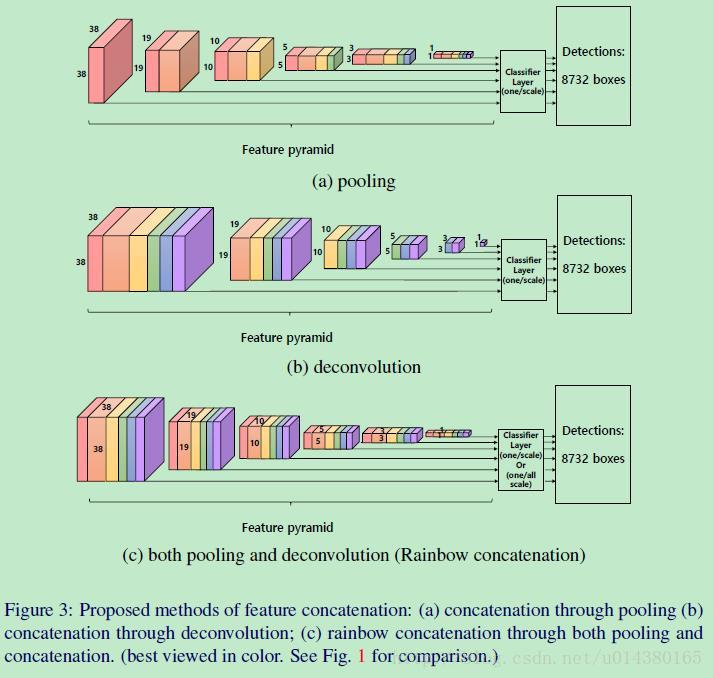

#### 应用场景
1. 人脸检测与识别任务
2. ADAS场景目标检测与识别(车、行人、非机动车)
3. 通用物体检测与识别
4. 自然场景下的文本检测与识别
5. 等等

#### 参考：

1. https://www.cnblogs.com/xuanyuyt/p/7447111.html#_label4
2. https://www.cnblogs.com/hellcat/p/9248489.html
   - 博主其他的文章也不错
