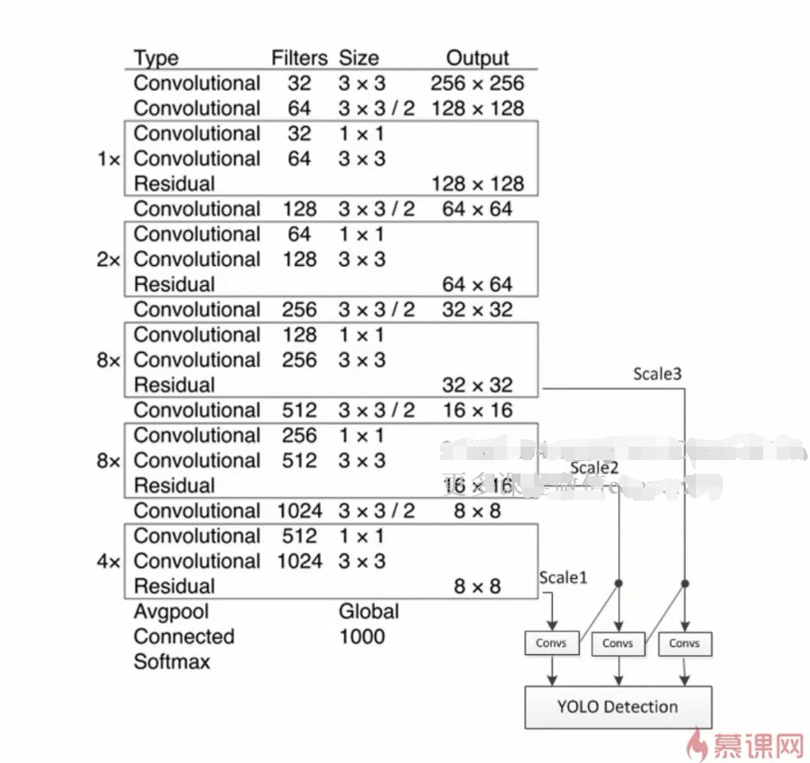

## Yolo V1算法原理介绍
- 同时预测多个Box位置和类别
- 端到端的目标检测和识别
- 速度更快
  - 实现回归功能的CNN并不需要复杂的设计过程
  - 直接选用征图训练模型，更好的区分目标和背景区域
- 使用GoogleNet作为主干网络
### 实现方法
- 图像被分成S×S个格子
- 包含GT物体中心的格子负责检测相应的物体
- 每个格子预测B个检测框及其置信度，以及C个类别的概率
  - bbox信息(w,y,w,h)为物体的中心位置相对格子位置的偏移及宽度和高度，均被归一化
  - 置信度反映是否包含物体以及包含物体情况下位置的准确性，定义为
  $$\mathrm{Pr}(\mathrm{Object}) * \mathrm{IOU}_{\text { pred }}^{\text { truth }}$$
  - 在 test 的时候，每个网格预测的 class 信息和 bounding box 预测的 confidence信息相乘，就得到每个 bounding box 的 class-specific confidence score:
  
  
$$
\operatorname{Pr}\left(\text { Class }_{i} | \text { Object }\right) * \operatorname{Pr}(\text { Object }) * \mathrm{IOU}_{\text { pred }}^{\text { truth }}=\operatorname{Pr}\left(\text { Class }_{i}\right) * \operatorname{IOU}_{\text { pred }}^{\text { truth }}
$$

<公式为啥出不来···>

- Yolo V1网络结构图

- 分析：
  - 网络使用小卷积，即1×1和3×3
  - FC层输出为S×S×(B×5+C)
  - 网络比VGG16快，准确率稍差

- Loss函数：均方和误差
  - 包含：坐标误差、IOU误差和分类误差
### 网络训练
- 预训练
  - ImageNet1000类数据与训练
- 使用预训练参数(20个conv)来初始化Yolo，并训练VOC20
-  将输入图像分辨率从224×224Resize到448×448
-  训练时B个bbox的GT设置相同

### 存在的问题
- 输入尺寸固定
- 小目标检测效果差
  - 同一个格子中包含多个目标时，仅仅检测一个(IOU最大)

## Yolo V2/Yolo 9000
### 原理介绍
- 引入了anchor box的思想
- 输出层：卷积层替代了Yolo V1的全连接层
- 联合使用coco(物体检测)和imagenet(物体分类)标注数据集。使用物体检测数据来学习物体的准确位置信息，用分类数据集来学习分类的信息
- 识别种类、精度、速度、和定位准确性等都有较大提升
- **改进之处**：
  - Batch Normalization
    - V1中也大量使用BN，同时在定位层使用DropOut防止过拟合
    - V2中取消了Dropout，均使用BN
  - 高分辨率分类器
    - V1使用224×224与训练，448×448用于检测网络
    - V2以448×448的分辨率微调最初的分类网络
  - Anchor Boxes
    - 预测bbox的偏移，使用卷积代替FX
    - 输入尺度：416
    - max pooling下采样
    - 预测超过1000个
    - map降低，recall显著提升
  - 细颗粒特征
    - 添加pass through layer,把千层特征图(26×26)连接到深层特征图
      - RestNet中的identify mapping
      - 把26×26×512的特征图叠加成13×13×2048的特征图，与深层特征图相连接，增加细粒度特征
      - 性能获得了1%的提升
  - Multi-Scale Training
    - 每隔几次迭代后就会微调网络的输入尺寸
      - 输入图像尺寸{320，352，...，608}
      - 尺度的变化

### 网络结构
- Darknet-19
  - pooling之后channel数增加
  - global average pooling
  - 1×1卷积压缩特征表示
  - batch normalization
    
  - 每个box包含4个坐标值，1个置信度和classes个条件类别 
  
     
    
    

### Yolo V3算法
### 简介
  - 速度和精度 最均衡的目标检测网络
  - 融合多种现今方法，改进Yolo V1/V2的缺点，且效果更优
    - 小物体识别问题

### 改进策略
  - 更好的主干网络(类ResNet)：精度更好
  - 多尺度预测(类FPN)
    - 聚类来得到Bbox的先验，选择9个簇以及三个度
    - 将这9个簇均将其按照大小均分给 3 个尺度。
    - 
  - 更好的分类器：分类损失采用 binary cross-entropy loss.
    - Softmax不适用于多标签分类。
    - Softmax 可被独立的多个 logistic 分类器替代，且准确率不会下降。 

### 优缺点
- 优点：
  - 快速，pipline简单
  - 背景误检率低
  - 通用性强
- 但相比RCNN系列物体检测方法，Yolo具有以下缺点
  - 识别物体位置精准性差
  - 召回率低

### 网络结构

## 参考资料：

论文
- [YOLOv3: An Incremental Improvement](https://arxiv.org/abs/1804.02767)
- [YOLO9000: Better, Faster, Stronger](https://arxiv.org/abs/1612.08242)
- [You Only Look Once: Unified, Real-Time Object Detection](https://arxiv.org/abs/1506.02640)

其他

- [YOLO主页](https://pjreddie.com/darknet/yolo/)
- [从YOLOv1到YOLOv3，目标检测的进化之路](https://blog.csdn.net/guleileo/article/details/80581858#t1)

