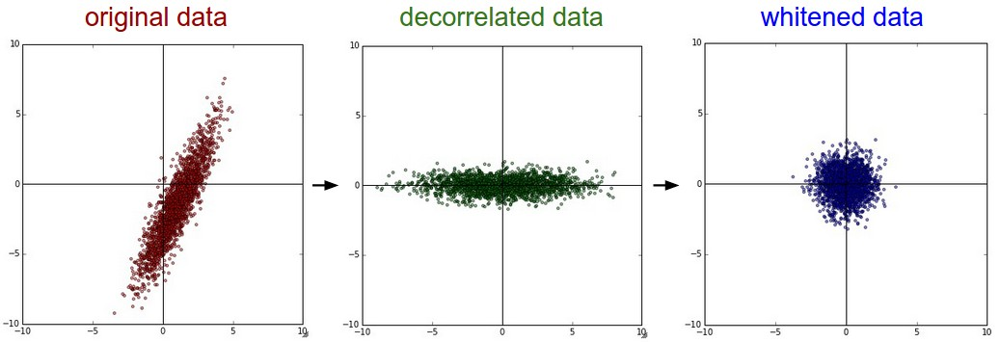

## 数据预处理

关于数据预处理我们有3个常用的符号，数据矩阵```X```，假设其尺寸是 ```[N x D]``` （```N``` 是数据样本的数量，```D``` 是数据的维
度）。

1. **均值减法（Mean subtraction）**
<br/> 

   均值减法是预处理最常用的形式。它对数据中每个独立特征减去平均值，从几何上可以理解为在每个维度上都将数据云的中心都迁移到原点。在numpy中，该操作可以通过代码 ```X -= np.mean(X, axis=0)```实现。而对于图像，更常用的是对所有像素都减去一个值，可以用 ```X -= np.mean(X)``` 实现，也可以在3个颜色通道上分别操作。
<br/> 

2. **归一化（Normalization）**
<br/> 

   归一化是指将数据的所有维度都归一化，使其数值范围都近似相等。有两种常用方法可以实现归一化。
   - 第一种是先对数据做零中心化（zero-centered）处理，然后每个维度都除以其标准差，实现代码为 ```X /= np.std(X, axis=0)```
   - 第二种方法是对每个维度都做归一化，使得每个维度的最大和最小值是1和-1。这个预处理操作只有在确信不同的输入特征有不同的数值范围（或计量单位）时才有意义，但要注意预处理操作的重要性几乎等同于学习算法本身。在图像处理中，由于像素的数值范围几乎是一致的（都在0-255之间），所以进行这个额外的预处理步骤并不是很必要。
  
   

   **一般数据预处理流程**： **左边** :原始的2维输入数据。 **中间** :在每个维度上都减去平均值后得到零中心化数据，现在数据云是以原点为中心的。 **右边** : 每个维度都除以其标准差来调整其数值范围。红色的线指出了数据各维度的数值范围，在中间的零中心化数据的数值范围不同，但在右边归一化数据中数值范围相同。
<br/> 

3. **PCA和白化（Whitening）**
<br/>

   PCA和白化（Whitening）是另一种预处理形式。在这种处理中，先对数据进行零中心化处理，然后计算协方差矩阵，它展示了数据中的相关性结构。
   
   ```
   # 假设输入数据矩阵X的尺寸为[N x D]
   X ‐= np.mean(X, axis = 0) # 对数据进行零中心化(重要)
   cov = np.dot(X.T, X) / X.shape[0] # 得到数据的协方差矩阵
   ```

   数据协方差矩阵的第(i, j)个元素是数据第i个和第j个维度的协方差。具体来说，该矩阵的对角线上的元素是方差。还有，协方差矩阵是对称和半正定的。我们可以对数据协方差矩阵进行SVD（奇异值分解）运算。

   ```
   U,S,V = np.linalg.svd(cov)
   ```
    
   U的列是特征向量，S是装有奇异值的1维数组（因为cov是对称且半正定的，所以S中元素是特征值的平方）。为了去除数据相关性，将已经零中心化处理过的原始数据投影到特征基准上：
   
   ```
   Xrot = np.dot(X,U) # 对数据去相关性
   ```
   
   注意U的列是标准正交向量的集合（范式为1，列之间标准正交），所以可以把它们看做标准正交基向量。因此，投影对应x中的数据的一个旋转，旋转产生的结果就是新的特征向量。如果计算Xrot的协方差矩阵，将会看到它是对角对称的。np.linalg.svd的一个良好性质是在它的返回值U中，特征向量是按照特征值的大小排列的。我们可以利用这个性质来对数据降维，只要使用前面的小部分特征向量，丢弃掉那些包含的数据没有方差的维度。 这个操作也被称为主成分分析（ [Principal Component Analysis](http://link.zhihu.com/?target=http%253A//en.wikipedia.org/wiki/Principal_component_analysis) 简称PCA）降维：

   ```
   Xrot_reduced = np.dot(X, U[:,:100]) # Xrot_reduced 变成 [N x 100]
   ```
   
   经过上面的操作，将原始的数据集的大小由[N x D]降到了[N x 100]，留下了数据中包含最大方差的100个维度。通常使用PCA降维过的数据训练线性分类器和神经网络会达到非常好的性能效果，同时还能节省时间和存储器空间。
<br/> 


   **白化**：白化操作的输入是特征基准上的数据，然后对每个维度除以其特征值来对数值范围进行归一化。该变换的几何解释是：如果数据服从多变量的高斯分布，那么经过白化后，数据的分布将会是一个均值为零，且协方差相等的矩阵。该操作的代码如下：
    
   ```
   # 对数据进行白化操作:
   # 除以特征值
   Xwhite = Xrot / np.sqrt(S + 1e‐5)
   ```
   
   警告：夸大的噪声。注意分母中添加了1e-5（或一个更小的常量）来防止分母为0。该变换的一个缺陷是在变换的过程中可能会夸大数据中的噪声，这是因为它将所有维度都拉伸到相同的数值范围，这些维度中也包含了那些只有极少差异性(方差小)而大多是噪声的维度。在实际操作中，这个问题可以用更强的平滑来解决（例如：采用比1e-5更大的值）。
   
   
    
   **PCA/白化**。 **左边** 是二维的原始数据。 **中间** : 经过PCA操作的数据。可以看出数据首先是零中心的，然后变换到了数据协方差矩阵的基准轴上。这样就对数据进行了解相关（协方差矩阵变成对角阵）。 **右边** : 每个维度都被特征值调整数值范围，将数据协方差矩阵变为单位矩阵。从几何上看，就是对数据在各个方向上拉伸压缩，使之变成服从高斯分布的一个数据点分布。
<br/> 


   **实践操作：** 在这个笔记中提到PCA和白化主要是为了介绍的完整性，实际上在**卷积神经网络中并不会采用这些变换**。然而对数据进行零中心化操作还是非常重要的，对每个像素进行归一化也很常见。
<br/> 

   **常见错误：** 进行预处理很重要的一点是：任何预处理策略（比如数据均值）都只能在训练集数据上进行计算，算法训练完毕后再应用到验证集或者测试集上。例如，如果先计算整个数据集图像的平均值然后每张图片都减去平均值，最后将整个数据集分成训练/验证/测试集，那么这个做法是**错误**的。应该怎么做呢？**应该先分成训练/验证/测试集，只是从训练集中求图片平均值，然后各个集（训练/验证/测试集）中的图像再减去这个平均值**。

## 权重初始化
<br/> 

- **注：全零初始化为错误方法**。**在训练完毕后，虽然不知道网络中每个权重的最终值应该是多少，但如果数据经过了恰当的归一化的话，就可以假设所有权重数值中大约一半为正数，一半为负数。这样，一个听起来蛮合理的想法就是把这些权重的初始值都设为0吧，因为在期望上来说0是最合理的猜测。这个做法错误的！因为如果网络中的每个神经元都计算出同样的输出，然后它们就会在反向传播中计算出同样的梯度，从而进行同样的参数更新。换句话说，如果权重被初始化为同样的值，神经元之间就失去了不对称性的源头。

1. **小随机数初始化** 
   
   权重初始值要非常接近0又不能等于0。解决方法就是将权重初始化为很小的数值，以此来打破对称性。
<br/> 
   其思路是：如果神经元刚开始的时候是随机且不相等的，那么它们将计算出不同的更新，并将自身变成整个网络的不同部分。小随机数权重初始化的实现方法是： ```W = 0.01 * np.random.randn(D,H) ```。其中 ```randn``` 函数是基于零均值和标准差的一个高斯分布（一般习惯称均值参数为期望$\mu$）来生成随机数的。根据这个式子，每个神经元的权重向量都被初始化为一个随机向量，而这些随机向量又服从一个多变量高斯分布，这样在输入空间中，所有的神经元的指向是随机的。也可以使用均匀分布生成的随机数，但是从实践结果来看，对于算法的结果影响极小。
<br/> 

   **警告：** 并不是小数值一定会得到好的结果。例如，一个神经网络的层中的权重值很小，那么在反向传播的时候就会计算出非常小的梯度（因为梯度与权重值是成比例的）。这就会很大程度上减小反向传播中的“梯度信号”，在深度网络中，就会出现问题。
    <br/> 

2. **使用```1/sqrt(n)```校准方差**
   
    上面做法存在一个问题，随着输入数据量的增长，随机初始化的神经元的输出数据的分布中的方差也在增大。
    <br/> 
    我们可以除以输入数据量的平方根来调整其数值范围，这样神经元输出的方差就归一化到1 了。也就是说，建议将神经元的权重向量初始化为： 
    ```
    w = np.random.randn(n) / sqrt(n)
    ```
    其中n是输入数据的数量。这样就保证了网络中所有神经元起始时有近似同样的输出分布。实践经验证明，这样做可以提高收敛的速度。

    <br/> 
    He等人的论文中给出了一种针对ReLU神经元的特殊初始化，代码为

    ```
    w =np.random.randn(n) * sqrt(2.0/n)
    ```
    这个形式是神经网络算法使用ReLU神经元时的当前最佳推荐。

    <br/> 

3. **稀疏初始化（Sparse initialization）** 
    
    另一个处理非标定方差的方法是将所有权重矩阵设为0，但是为了打破对称性，每个神经元都同下一层固定数目的神经元随机连接（其权重数值由一个小的高斯分布生成）。一个比较典型的连接数目是10个。
<br/>

4. **偏置（biases）的初始化** 
   
    通常将偏置初始化为0，这是因为随机小数值权重矩阵已经打破了对称性。对于ReLU非线性激活函数，有研究人员喜欢使用如0.01这样的小数值常量作为所有偏置的初始值，这是因为他们认为这样做能让所有的ReLU单元一开始就激活，这样就能保存并传播一些梯度。然而，这样做是不是总是能提高算法性能并不清楚（有时候实验结果反而显示性能更差），所以通常还是使用0来初始化偏置参数。
<br/>

5. **批量归一化（Batch Normalization）** 

    批量归一化是loffe和Szegedy最近才提出的方法，该方法减轻了如何合理初始化神经网络这个棘手问题带来的头痛）
    <br/>

    **其做法**是让激活数据在训练开始前通过一个网络，网络处理数据使其服从标准高斯分布。因为归一化是一个简单可求导的操作，所以上述思路是可行的。在实现层面，应用这个技巧通常意味着全连接层（或者是卷积层，后续会讲）与激活函数之间添加一个BatchNorm层。需要知道的是在神经网络中使用批量归一化已经变得非常常见。在实践中，使用了批量归一化的网络对于不好的初始值有更强的鲁棒性。最后一句话总结：批量归一化可以理解为在网络的每一层之前都做预处理，只是这种操作以另一种方式与网络集成在了一起。搞定！

**实践：**
<br/>
  
当前的推荐是使用ReLU激活函数，并且使用```w = np.random.randn(n) * sqrt(2.0/n)``` 来进行权重初始化，关于这一点，这篇[文章](http://link.zhihu.com/?target=http%253A//arxiv-web3.library.cornell.edu/abs/1502.01852)有讨论。
