<!-- TOC -->

- [1、欠拟合与过拟合？](#1%e6%ac%a0%e6%8b%9f%e5%90%88%e4%b8%8e%e8%bf%87%e6%8b%9f%e5%90%88)
  - [1.1 如何解决过拟合？](#11-%e5%a6%82%e4%bd%95%e8%a7%a3%e5%86%b3%e8%bf%87%e6%8b%9f%e5%90%88)
  - [1.2 如何解决欠拟合？](#12-%e5%a6%82%e4%bd%95%e8%a7%a3%e5%86%b3%e6%ac%a0%e6%8b%9f%e5%90%88)
- [2、梯度消失？](#2%e6%a2%af%e5%ba%a6%e6%b6%88%e5%a4%b1)
- [3、梯度爆炸？](#3%e6%a2%af%e5%ba%a6%e7%88%86%e7%82%b8)
- [4、BN层的原理？](#4bn%e5%b1%82%e7%9a%84%e5%8e%9f%e7%90%86)
- [5、权重初始化？](#5%e6%9d%83%e9%87%8d%e5%88%9d%e5%a7%8b%e5%8c%96)
- [6、调参心得](#6%e8%b0%83%e5%8f%82%e5%bf%83%e5%be%97)
- [7、数据预处理](#7%e6%95%b0%e6%8d%ae%e9%a2%84%e5%a4%84%e7%90%86)
- [8、softNMS](#8softnms)
- [9、FPN](#9fpn)
- [10、RPN](#10rpn)
- [11、Focal loss](#11focal-loss)
- [12、深度可分离卷积](#12%e6%b7%b1%e5%ba%a6%e5%8f%af%e5%88%86%e7%a6%bb%e5%8d%b7%e7%a7%af)
- [13、卷积神经网络参数量计算](#13%e5%8d%b7%e7%a7%af%e7%a5%9e%e7%bb%8f%e7%bd%91%e7%bb%9c%e5%8f%82%e6%95%b0%e9%87%8f%e8%ae%a1%e7%ae%97)
  - [卷积层参数数量计算](#%e5%8d%b7%e7%a7%af%e5%b1%82%e5%8f%82%e6%95%b0%e6%95%b0%e9%87%8f%e8%ae%a1%e7%ae%97)
  - [Fully Connected (FC) Layer参数数量](#fully-connected-fc-layer%e5%8f%82%e6%95%b0%e6%95%b0%e9%87%8f)
- [14、为什么VGG要用3*3的卷积核](#14%e4%b8%ba%e4%bb%80%e4%b9%88vgg%e8%a6%81%e7%94%a833%e7%9a%84%e5%8d%b7%e7%a7%af%e6%a0%b8)
- [15、1×1卷积的作用？](#151%c3%971%e5%8d%b7%e7%a7%af%e7%9a%84%e4%bd%9c%e7%94%a8)
- [16、为什么One-stage在精度上逊色于twp-stage，但是速度完胜？](#16%e4%b8%ba%e4%bb%80%e4%b9%88one-stage%e5%9c%a8%e7%b2%be%e5%ba%a6%e4%b8%8a%e9%80%8a%e8%89%b2%e4%ba%8etwp-stage%e4%bd%86%e6%98%af%e9%80%9f%e5%ba%a6%e5%ae%8c%e8%83%9c)
- [17、RetinaNet](#17retinanet)
- [18、YOLOv2和YOLOv3的区别](#18yolov2%e5%92%8cyolov3%e7%9a%84%e5%8c%ba%e5%88%ab)
- [19、CNN的本质是什么？](#19cnn%e7%9a%84%e6%9c%ac%e8%b4%a8%e6%98%af%e4%bb%80%e4%b9%88)
- [20、池化层如何反向传播](#20%e6%b1%a0%e5%8c%96%e5%b1%82%e5%a6%82%e4%bd%95%e5%8f%8d%e5%90%91%e4%bc%a0%e6%92%ad)
- [21、ResNet](#21resnet)
- [22、FCN](#22fcn)
- [23、Accuracy、Precision、Recall和F1 Score](#23accuracyprecisionrecall%e5%92%8cf1-score)
- [24、ROI Pooling、ROI Align](#24roi-poolingroi-align)
- [25、ResNet v1与ResNet v2的区别](#25resnet-v1%e4%b8%8eresnet-v2%e7%9a%84%e5%8c%ba%e5%88%ab)
- [26、优化方法](#26%e4%bc%98%e5%8c%96%e6%96%b9%e6%b3%95)
  - [梯度下降法的三种形式BGD、SGD以及MBGD](#%e6%a2%af%e5%ba%a6%e4%b8%8b%e9%99%8d%e6%b3%95%e7%9a%84%e4%b8%89%e7%a7%8d%e5%bd%a2%e5%bc%8fbgdsgd%e4%bb%a5%e5%8f%8ambgd)
  - [总结](#%e6%80%bb%e7%bb%93)
  - [SGD存在的问题：](#sgd%e5%ad%98%e5%9c%a8%e7%9a%84%e9%97%ae%e9%a2%98)
  - [SGD改进及变种](#sgd%e6%94%b9%e8%bf%9b%e5%8f%8a%e5%8f%98%e7%a7%8d)
    - [1: SGD + Momentum：](#1-sgd--momentum)
    - [2：Nesterov Momentum](#2nesterov-momentum)
    - [3：Adagrad](#3adagrad)
    - [4：RMSprop](#4rmsprop)
    - [5: ADAM](#5-adam)
    - [学习率衰减的方法](#%e5%ad%a6%e4%b9%a0%e7%8e%87%e8%a1%b0%e5%87%8f%e7%9a%84%e6%96%b9%e6%b3%95)
    - [二阶优化方法](#%e4%ba%8c%e9%98%b6%e4%bc%98%e5%8c%96%e6%96%b9%e6%b3%95)
    - [L-BFGS方法](#l-bfgs%e6%96%b9%e6%b3%95)
    - [模型集成](#%e6%a8%a1%e5%9e%8b%e9%9b%86%e6%88%90)
    - [总结：](#%e6%80%bb%e7%bb%93)
- [27、网络模型的压缩与量化](#27%e7%bd%91%e7%bb%9c%e6%a8%a1%e5%9e%8b%e7%9a%84%e5%8e%8b%e7%bc%a9%e4%b8%8e%e9%87%8f%e5%8c%96)
- [28、MobileNetV1与MobileNetV2简介](#28mobilenetv1%e4%b8%8emobilenetv2%e7%ae%80%e4%bb%8b)
  - [一、参数数量和理论计算量](#%e4%b8%80%e5%8f%82%e6%95%b0%e6%95%b0%e9%87%8f%e5%92%8c%e7%90%86%e8%ae%ba%e8%ae%a1%e7%ae%97%e9%87%8f)
    - [1、定义](#1%e5%ae%9a%e4%b9%89)
    - [2、计算公式](#2%e8%ae%a1%e7%ae%97%e5%85%ac%e5%bc%8f)
  - [二、MobileNetV1](#%e4%ba%8cmobilenetv1)
    - [1、能够减少参数数量和计算量的原理](#1%e8%83%bd%e5%a4%9f%e5%87%8f%e5%b0%91%e5%8f%82%e6%95%b0%e6%95%b0%e9%87%8f%e5%92%8c%e8%ae%a1%e7%ae%97%e9%87%8f%e7%9a%84%e5%8e%9f%e7%90%86)
    - [2、MobileNetV1 中引入的两个超参数](#2mobilenetv1-%e4%b8%ad%e5%bc%95%e5%85%a5%e7%9a%84%e4%b8%a4%e4%b8%aa%e8%b6%85%e5%8f%82%e6%95%b0)
    - [3、标准卷积和深度可分离卷积的区别](#3%e6%a0%87%e5%87%86%e5%8d%b7%e7%a7%af%e5%92%8c%e6%b7%b1%e5%ba%a6%e5%8f%af%e5%88%86%e7%a6%bb%e5%8d%b7%e7%a7%af%e7%9a%84%e5%8c%ba%e5%88%ab)
  - [三、MobileNetV2](#%e4%b8%89mobilenetv2)
    - [1、主要改进点](#1%e4%b8%bb%e8%a6%81%e6%94%b9%e8%bf%9b%e7%82%b9)
    - [2、和 MobileNetV1 的区别](#2%e5%92%8c-mobilenetv1-%e7%9a%84%e5%8c%ba%e5%88%ab)
    - [3、和ResNet的区别](#3%e5%92%8cresnet%e7%9a%84%e5%8c%ba%e5%88%ab)
- [29、学习率的调整](#29%e5%ad%a6%e4%b9%a0%e7%8e%87%e7%9a%84%e8%b0%83%e6%95%b4)
- [30、训练样本不均衡的问题](#30%e8%ae%ad%e7%bb%83%e6%a0%b7%e6%9c%ac%e4%b8%8d%e5%9d%87%e8%a1%a1%e7%9a%84%e9%97%ae%e9%a2%98)
- [31、Group convolution？](#31group-convolution)
- [33、AP、mAP计算](#33apmap%e8%ae%a1%e7%ae%97)
- [36、InceptionNet](#36inceptionnet)
  - [1、Inception V1如何降低参数量的？](#1inception-v1%e5%a6%82%e4%bd%95%e9%99%8d%e4%bd%8e%e5%8f%82%e6%95%b0%e9%87%8f%e7%9a%84)
  - [2、Inception Net设计的思考是什么？(好的深度网络有哪些设计原则)](#2inception-net%e8%ae%be%e8%ae%a1%e7%9a%84%e6%80%9d%e8%80%83%e6%98%af%e4%bb%80%e4%b9%88%e5%a5%bd%e7%9a%84%e6%b7%b1%e5%ba%a6%e7%bd%91%e7%bb%9c%e6%9c%89%e5%93%aa%e4%ba%9b%e8%ae%be%e8%ae%a1%e5%8e%9f%e5%88%99)
  - [3、Inception如何减少参数量的？](#3inception%e5%a6%82%e4%bd%95%e5%87%8f%e5%b0%91%e5%8f%82%e6%95%b0%e9%87%8f%e7%9a%84)
- [前沿](#%e5%89%8d%e6%b2%bf)
  - [RefineDet](#refinedet)
  - [Cascade R-CNN](#cascade-r-cnn)
  - [Bottlenet layer](#bottlenet-layer)
- [37、TensorRT原理](#37tensorrt%e5%8e%9f%e7%90%86)

<!-- /TOC -->
### 1、欠拟合与过拟合？

**过拟合（Over-Fitting）**

高方差

在训练集上误差小，但在测试集上误差大，我们将这种情况称为高方差（high variance），也叫过拟合。


**欠拟合（Under-Fitting）**

在训练集上训练效果不好（测试集上也不好），准确率不高，我们将这种情况称为高偏差（high bias），也叫欠拟合。

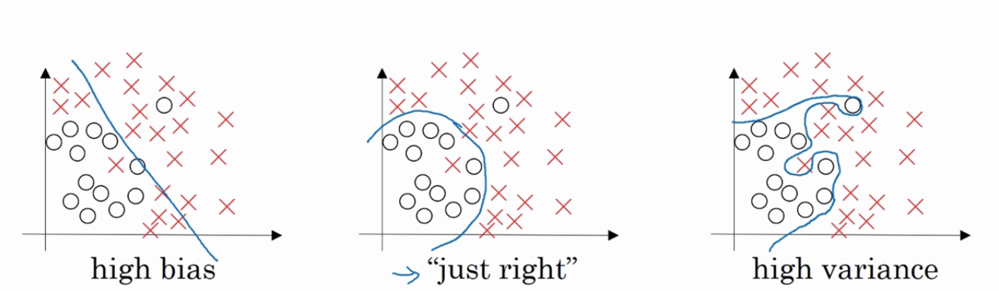

#### 1.1 如何解决过拟合？

- 获取更多的数据集
  
- 采用合适的模型
  
- 使用Dropout
  
-  正则化
  
- Early Stopping
  
- 可变化的学习率
  
- 使用 Batch_Normalization
  
**增加数据集是解决过拟合的根本性方法**

#### 1.2 如何解决欠拟合？

**如何解决欠拟合？**

- 添加新特征
  
- 添加多项式特征
  
- 减少正则化参数
  
- 增加网络复杂度
  
- 使用集成学习方法，如Bagging


### 2、梯度消失？

关于梯度消失，以sigmoid函数为例子，sigmoid函数使得输出在[0,1]之间。
	
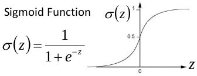

事实上x到了一定大小，经过sigmoid函数的输出范围就很小了，参考下图
	


如果输入很大，其对应的斜率就很小，我们知道，其斜率（梯度）在反向传播中是权值学习速率。所以就会出现如下的问题，
	
**在深度网络中，如果网络的激活输出很大，其梯度就很小，学习速率就很慢。假设每层学习梯度都小于最大值0.25，网络有n层，因为链式求导的原因，第一层的梯度小于0.25的n次方，所以学习速率就慢，对于最后一层只需对自身求导1次，梯度就大，学习速率就快。**

这会造成两个影响：

 1. 在一个很大的深度网络中，浅层基本不学习，权值变化小，后面几层一直在学习，结果就是，后面几层基本可以表示整个网络，失去了深度的意义。
   
 2. 造成网络无法收敛。

**如何解决梯度消失问题？**

- **relu, dropout等小技巧**，第二波深度学习算法已经基本抛弃了预训练的做法。引入RELU代替sigmoid激活函数。
  
- **ResNet** 深度残差学习（deepresidual learning）进一步避免了梯度消失（其实是把高阶特征和低阶做融合）。
  
- **归一初始化** 各层输入归一化，使得可以收敛的网络的深度提升为原来的十倍。

### 3、梯度爆炸？

**什么是梯度爆炸？** 误差梯度是神经网络训练过程中计算的方向和数量，用于以正确的方向和合适的量更新网络权重。 在深层网络或循环神经网络中，误差梯度可在更新中累积，变成非常大的梯度，然后导致网络权重的大幅更新，并因此使网络变得不稳定。在极端情况下，权重的值变得非常大，以至于溢出，导致 NaN 值。 网络层之间的梯度（值大于 1.0）重复相乘导致的指数级增长会产生梯度爆炸。 

梯度爆炸引发的问题

- 在深度多层感知机网络中，梯度爆炸会引起网络不稳定
  
- 最好的结果是无法从训练数据中学习
  
- 而最坏的结果是出现无法再更新的 NaN 权重值。


**如何确定是否出现梯度爆炸？** 
训练过程中出现梯度爆炸会伴随一些细微的信号，如：

- 模型无法从训练数据中获得更新（如低损失）。
  
- 模型不稳定，导致更新过程中的损失出现显著变化。
  
- 训练过程中，模型损失变成 NaN。
  
如果你发现这些问题，那么你需要仔细查看是否出现梯度爆炸问题。 以下是一些稍微明显一点的信号，有助于确认是否出现梯度爆炸问题。

- 训练过程中模型梯度快速变大。
  
- 训练过程中模型权重变成 NaN 值。

训练过程中，每个节点和层的误差梯度值持续超过1.0。

**如何修复梯度爆炸问题？**

- **重新设计网络模型** 在深度神经网络中，梯度爆炸可以通过重新设计层数更少的网络来解决。 使用更小的批尺寸对网络训练也有好处。 在循环神经网络中，训练过程中在更少的先前时间步上进行更新（沿时间的截断反向传播，truncated Backpropagation through time）可以缓解梯度爆炸问题。 
  
- **使用 ReLU 激活函数** 在深度多层感知机神经网络中，梯度爆炸的发生可能是因为激活函数，如之前很流行的 Sigmoid 和 Tanh 函数。 使用 ReLU 激活函数可以减少梯度爆炸。采用 ReLU 激活函数是最适合隐藏层的新实践。 
  
- **使用长短期记忆网络** 在循环神经网络中，梯度爆炸的发生可能是因为某种网络的训练本身就存在不稳定性，如随时间的反向传播本质上将循环网络转换成深度多层感知机神经网络。 使用长短期记忆（LSTM）单元和相关的门类型神经元结构可以减少梯度爆炸问题。 采用 LSTM 单元是适合循环神经网络的序列预测的最新最好实践。
  
- **使用梯度截断（Gradient Clipping）** 在非常深且批尺寸较大的多层感知机网络和输入序列较长的 LSTM 中，仍然有可能出现梯度爆炸。 如果梯度爆炸仍然出现，你可以在训练过程中检查和限制梯度的大小。这就是梯度截断。
  
- **使用权重正则化（Weight Regularization）** 如果梯度爆炸仍然存在，可以尝试另一种方法，即检查网络权重的大小，并惩罚产生较大权重值的损失函数。该过程被称为权重正则化，通常使用的是 L1 惩罚项（权重绝对值）或 L2 惩罚项（权重平方）。

### 4、BN层的原理？

BN算法像卷积层，池化层、激活层一样也输入一层。BN层添加在激活函数前，对输入激活函数的输入进行归一化。这样解决了输入数据发生偏移和增大的影响。

**优点：**

- 加快训练速度，能够增大学习率，即使小的学习率也能够有快速的学习速率;
  
- 可以省去droupout、L2 正则化项 采用BN算法可以省去这两项或者只需要小的L2正则化约束。原因：BN算法后，参数进行了归一化，原本经过激活函数没有太大影响的神经元，分布变得明显，经过一个激活函数以后，神经元会自动削弱或者去除一些神经元，就不用再对其进行dropout。另外就是L2正则化，由于每次训练都进行了归一化，就很少发生由于数据分布不同导致的参数变动过大，带来的参数不断增大。
  
- 可以把训练数据集打乱，防止训练发生偏移。

**公式如下**


### 5、权重初始化？

>注：全零初始化为错误方法。**在训练完毕后，虽然不知道网络中每个权重的最终值应该是多少，但如果数据经过了恰当的归一化的话，就可以假设所有权重数值中大约一半为正数，一半为负数。这样，一个听起来蛮合理的想法就是把这些权重的初始值都设为0吧，因为在期望上来说0是最合理的猜测。这个做法错误的！因为如果网络中的每个神经元都计算出同样的输出，然后它们就会在反向传播中计算出同样的梯度，从而进行同样的参数更新。换句话说，如果权重被初始化为同样的值，神经元之间就失去了不对称性的源头。

1. **小随机数初始化** 
   
   权重初始值要非常接近0又不能等于0。解决方法就是将权重初始化为很小的数值，以此来打破对称性。
    <br>
    其思路是：如果神经元刚开始的时候是随机且不相等的，那么它们将计算出不同的更新，并将自身变成整个网络的不同部分。小随机数权重初始化的实现方法是： ```W = 0.01 * np.random.randn(D,H) ```。其中 ```randn``` 函数是基于零均值和标准差的一个高斯分布（一般习惯称均值参数为期望$\mu$）来生成随机数的。根据这个式子，每个神经元的权重向量都被初始化为一个随机向量，而这些随机向量又服从一个多变量高斯分布，这样在输入空间中，所有的神经元的指向是随机的。也可以使用均匀分布生成的随机数，但是从实践结果来看，对于算法的结果影响极小。
<br/> 

   **警告：** 并不是小数值一定会得到好的结果。例如，一个神经网络的层中的权重值很小，那么在反向传播的时候就会计算出非常小的梯度（因为梯度与权重值是成比例的）。这就会很大程度上减小反向传播中的“梯度信号”，在深度网络中，就会出现问题。
    <br/> 

1. **使用```1/sqrt(n)```校准方差**
   
    上面做法存在一个问题，随着输入数据量的增长，随机初始化的神经元的输出数据的分布中的方差也在增大。

    <br/> 
    我们可以除以输入数据量的平方根来调整其数值范围，这样神经元输出的方差就归一化到1 了。也就是说，建议将神经元的权重向量初始化为： 

    ```
    w = np.random.randn(n) / sqrt(n)
    ```

    其中n是输入数据的数量。这样就保证了网络中所有神经元起始时有近似同样的输出分布。实践经验证明，这样做可以提高收敛的速度。

    <br/> 
    He等人的论文中给出了一种针对ReLU神经元的特殊初始化，代码为

    ```
    w =np.random.randn(n) * sqrt(2.0/n)
    ```

    这个形式是神经网络算法使用ReLU神经元时的当前最佳推荐。

    <br/> 

2. **稀疏初始化（Sparse initialization）** 
    
    另一个处理非标定方差的方法是将所有权重矩阵设为0，但是为了打破对称性，每个神经元都同下一层固定数目的神经元随机连接（其权重数值由一个小的高斯分布生成）。一个比较典型的连接数目是10个。
<br/>

4. **偏置（biases）的初始化** 
   
    通常将偏置初始化为0，这是因为随机小数值权重矩阵已经打破了对称性。对于ReLU非线性激活函数，有研究人员喜欢使用如0.01这样的小数值常量作为所有偏置的初始值，这是因为他们认为这样做能让所有的ReLU单元一开始就激活，这样就能保存并传播一些梯度。然而，这样做是不是总是能提高算法性能并不清楚（有时候实验结果反而显示性能更差），所以通常还是使用0来初始化偏置参数。

<br/>

5. **批量归一化（Batch Normalization）** 

    批量归一化是loffe和Szegedy最近才提出的方法，该方法减轻了如何合理初始化神经网络这个棘手问题带来的头痛）
    <br/>

    **其做法**是让激活数据在训练开始前通过一个网络，网络处理数据使其服从标准高斯分布。因为归一化是一个简单可求导的操作，所以上述思路是可行的。在实现层面，应用这个技巧通常意味着全连接层（或者是卷积层，后续会讲）与激活函数之间添加一个BatchNorm层。需要知道的是在神经网络中使用批量归一化已经变得非常常见。在实践中，使用了批量归一化的网络对于不好的初始值有更强的鲁棒性。最后一句话总结：批量归一化可以理解为在网络的每一层之前都做预处理，只是这种操作以另一种方式与网络集成在了一起。搞定！

**实践：**
<br/>

当前的推荐是使用ReLU激活函数，并且使用```w = np.random.randn(n) * sqrt(2.0/n)``` 来进行权重初始化，关于这一点，这篇[文章](http://link.zhihu.com/?target=http%253A//arxiv-web3.library.cornell.edu/abs/1502.01852)有讨论。


### 6、调参心得

[查看CSDN解答](https://blog.csdn.net/m0_37644085/article/details/88956758)


### 7、数据预处理

关于数据预处理我们有3个常用的符号，数据矩阵```X```，假设其尺寸是 ```[N x D]``` （```N``` 是数据样本的数量，```D``` 是数据的维
度）。

1. **均值减法（Mean subtraction）**
<br/> 

   均值减法是预处理最常用的形式。它对数据中每个独立特征减去平均值，从几何上可以理解为在每个维度上都将数据云的中心都迁移到原点。在numpy中，该操作可以通过代码 ```X -= np.mean(X, axis=0)```实现。而对于图像，更常用的是对所有像素都减去一个值，可以用 ```X -= np.mean(X)``` 实现，也可以在3个颜色通道上分别操作。
<br/> 

2. **归一化（Normalization）**
<br/> 

   归一化是指将数据的所有维度都归一化，使其数值范围都近似相等。有两种常用方法可以实现归一化。
   - 第一种是先对数据做零中心化（zero-centered）处理，然后每个维度都除以其标准差，实现代码为 ```X /= np.std(X, axis=0)```
   - 第二种方法是对每个维度都做归一化，使得每个维度的最大和最小值是1和-1。这个预处理操作只有在确信不同的输入特征有不同的数值范围（或计量单位）时才有意义，但要注意预处理操作的重要性几乎等同于学习算法本身。在图像处理中，由于像素的数值范围几乎是一致的（都在0-255之间），所以进行这个额外的预处理步骤并不是很必要。
  
   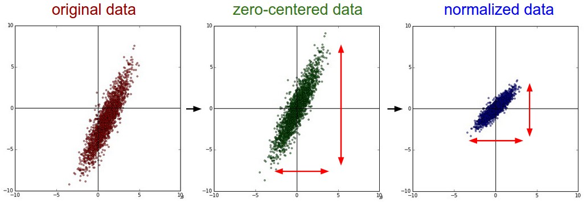

   **一般数据预处理流程**： **左边** :原始的2维输入数据。 **中间** :在每个维度上都减去平均值后得到零中心化数据，现在数据云是以原点为中心的。 **右边** : 每个维度都除以其标准差来调整其数值范围。红色的线指出了数据各维度的数值范围，在中间的零中心化数据的数值范围不同，但在右边归一化数据中数值范围相同。
<br/> 

3. **PCA和白化（Whitening）**
<br/>

   PCA和白化（Whitening）是另一种预处理形式。在这种处理中，先对数据进行零中心化处理，然后计算协方差矩阵，它展示了数据中的相关性结构。
   
   ```
   # 假设输入数据矩阵X的尺寸为[N x D]
   X ‐= np.mean(X, axis = 0) # 对数据进行零中心化(重要)
   cov = np.dot(X.T, X) / X.shape[0] # 得到数据的协方差矩阵
   ```

   数据协方差矩阵的第(i, j)个元素是数据第i个和第j个维度的协方差。具体来说，该矩阵的对角线上的元素是方差。还有，协方差矩阵是对称和半正定的。我们可以对数据协方差矩阵进行SVD（奇异值分解）运算。

   ```
   U,S,V = np.linalg.svd(cov)
   ```
    
   U的列是特征向量，S是装有奇异值的1维数组（因为cov是对称且半正定的，所以S中元素是特征值的平方）。为了去除数据相关性，将已经零中心化处理过的原始数据投影到特征基准上：
   
   ```
   Xrot = np.dot(X,U) # 对数据去相关性
   ```
   
   注意U的列是标准正交向量的集合（范式为1，列之间标准正交），所以可以把它们看做标准正交基向量。因此，投影对应x中的数据的一个旋转，旋转产生的结果就是新的特征向量。如果计算Xrot的协方差矩阵，将会看到它是对角对称的。np.linalg.svd的一个良好性质是在它的返回值U中，特征向量是按照特征值的大小排列的。我们可以利用这个性质来对数据降维，只要使用前面的小部分特征向量，丢弃掉那些包含的数据没有方差的维度。 这个操作也被称为主成分分析（ [Principal Component Analysis](http://link.zhihu.com/?target=http%253A//en.wikipedia.org/wiki/Principal_component_analysis) 简称PCA）降维：

   ```
   Xrot_reduced = np.dot(X, U[:,:100]) # Xrot_reduced 变成 [N x 100]
   ```
   
   经过上面的操作，将原始的数据集的大小由[N x D]降到了[N x 100]，留下了数据中包含最大方差的100个维度。通常使用PCA降维过的数据训练线性分类器和神经网络会达到非常好的性能效果，同时还能节省时间和存储器空间。
<br/> 


   **白化**：白化操作的输入是特征基准上的数据，然后对每个维度除以其特征值来对数值范围进行归一化。该变换的几何解释是：如果数据服从多变量的高斯分布，那么经过白化后，数据的分布将会是一个均值为零，且协方差相等的矩阵。该操作的代码如下：
    
   ```
   # 对数据进行白化操作:
   # 除以特征值
   Xwhite = Xrot / np.sqrt(S + 1e‐5)
   ```
   
   警告：夸大的噪声。注意分母中添加了1e-5（或一个更小的常量）来防止分母为0。该变换的一个缺陷是在变换的过程中可能会夸大数据中的噪声，这是因为它将所有维度都拉伸到相同的数值范围，这些维度中也包含了那些只有极少差异性(方差小)而大多是噪声的维度。在实际操作中，这个问题可以用更强的平滑来解决（例如：采用比1e-5更大的值）。
   
   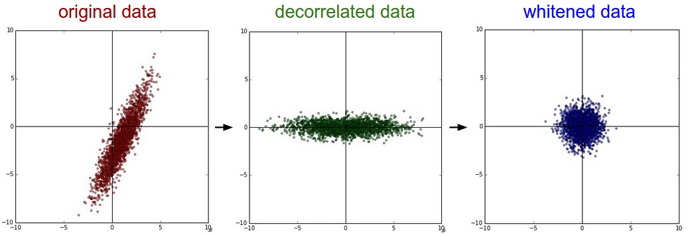
    
   **PCA/白化**。 **左边** 是二维的原始数据。 **中间** : 经过PCA操作的数据。可以看出数据首先是零中心的，然后变换到了数据协方差矩阵的基准轴上。这样就对数据进行了解相关（协方差矩阵变成对角阵）。 **右边** : 每个维度都被特征值调整数值范围，将数据协方差矩阵变为单位矩阵。从几何上看，就是对数据在各个方向上拉伸压缩，使之变成服从高斯分布的一个数据点分布。
<br/> 


   **实践操作：** 在这个笔记中提到PCA和白化主要是为了介绍的完整性，实际上在**卷积神经网络中并不会采用这些变换**。然而对数据进行零中心化操作还是非常重要的，对每个像素进行归一化也很常见。
<br/> 

   **常见错误：** 进行预处理很重要的一点是：任何预处理策略（比如数据均值）都只能在训练集数据上进行计算，算法训练完毕后再应用到验证集或者测试集上。例如，如果先计算整个数据集图像的平均值然后每张图片都减去平均值，最后将整个数据集分成训练/验证/测试集，那么这个做法是**错误**的。应该怎么做呢？**应该先分成训练/验证/测试集，只是从训练集中求图片平均值，然后各个集（训练/验证/测试集）中的图像再减去这个平均值**。

### 8、softNMS

非极大值抑制算法（Non-maximum suppression, NMS）的本质是搜索局部极大值，抑制非极大值元素。  物体检测中应用NMS算法的主要目的是消除多余（交叉重复）的窗口，找到最佳物体检测位置。

绝大部分目标检测方法，最后都要用到 NMS-非极大值抑制进行后处理。 通常的做法是将检测框按得分排序，然后保留得分最高的框，同时删除与该框重叠面积大于一定比例的其它框。

这种贪心式方法存在如下图所示的问题： 

- 红色框和绿色框是当前的检测结果，二者的得分分别是0.95和0.80。如果按照传统的NMS进行处理，首先选中得分最高的红色框，然后绿色框就会因为与之重叠面积过大而被删掉。

- 另一方面，NMS的阈值也不太容易确定，设小了会出现下图的情况（绿色框因为和红色框重叠面积较大而被删掉），设置过高又容易增大误检。

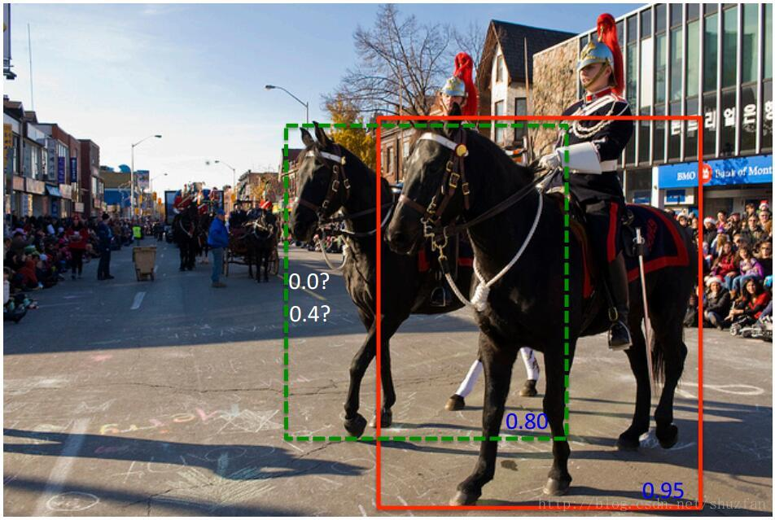

**softNMS的思想**：不要粗鲁地删除所有IOU大于阈值的框，而是降低其置信度。

原来的NMS可以描述如下：将IOU大于阈值的窗口的得分全部置为0。

$$
s_{i}=\left\{\begin{array}{ll}{s_{i},} & {\text { iou }\left(\mathcal{M}, b_{i}\right)<N_{t}} \\ {0,} & {\text { iou }\left(\mathcal{M}, b_{i}\right) \geq N_{t}}\end{array}\right.
$$

**softNMS公式如下：（有两种方式）**

  - 线性加权
  
$$
s_{i}=\left\{\begin{array}{ll}{s_{i},} & {\text { iou }\left(\mathcal{M}, b_{i}\right)<N_{t}} \\ {s_{i}\left(1-\text { iou }\left(\mathcal{M}, b_{i}\right)\right),} & {\text { iou }\left(\mathcal{M}, b_{i}\right) \geq N_{t}}\end{array}\right.
$$

  - 高斯加权
  
    $$
    s_{i}=s_{i} e^{-\frac{i o u\left(\mathcal{M}, b_{i}\right)^{2}}{\sigma}}, \forall b_{i} \notin \mathcal{D}
    $$

  分析上面的两种改进形式，思想都是：$M$为当前得分最高框， 为待处理框， 和$M$的$IOU$越大， 的得分就下降的越厉害。

### 9、FPN

论文：feature pyramid networks for object detection

论文链接：https://arxiv.org/abs/1612.03144

作者提出的多尺度的object detection算法：FPN（feature pyramid networks）。原来多数的object detection算法都是只采用顶层特征做预测，但我们知道低层的特征语义信息比较少，但是目标位置准确；高层的特征语义信息比较丰富，但是目标位置比较粗略。另外虽然也有些算法采用多尺度特征融合的方式，但是一般是采用融合后的特征做预测，而本文不一样的地方在于预测是在不同特征层独立进行的。

下图展示了4种利用特征的形式：

（a）图像金字塔，即将图像做成不同的scale，然后不同scale的图像生成对应的不同scale的特征。这种方法的缺点在于增加了时间成本。有些算法会在测试时候采用图像金字塔。

（b）像SPP net，Fast RCNN，Faster RCNN是采用这种方式，即仅采用网络最后一层的特征。

（c）像SSD（Single Shot Detector）采用这种多尺度特征融合的方式，没有上采样过程，即从网络不同层抽取不同尺度的特征做预测，这种方式不会增加额外的计算量。作者认为SSD算法中没有用到足够低层的特征（在SSD中，最低层的特征是VGG网络的conv4_3），而在作者看来足够低层的特征对于检测小物体是很有帮助的。

（d）本文作者是采用这种方式，顶层特征通过上采样和低层特征做融合，而且每层都是独立预测的。

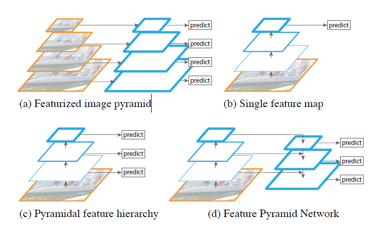

作者的主网络采用ResNet。算法大致结构如下图：一个自底向上的线路，一个自顶向下的线路，横向连接（lateral connection）。图中放大的区域就是横向连接，这里1*1的卷积核的主要作用是减少卷积核的个数，也就是减少了feature map的个数，并不改变feature map的尺寸大小。

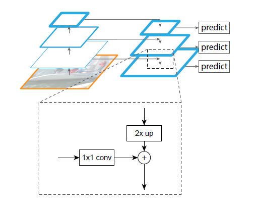

**自底向上**其实就是网络的前向过程。在前向过程中，feature map的大小在经过某些层后会改变，而在经过其他一些层的时候不会改变，作者将不改变feature map大小的层归为一个stage，因此每次抽取的特征都是每个stage的最后一个层输出，这样就能构成特征金字塔。

**自顶向下**的过程采用上采样（upsampling）进行，而横向连接则是将上采样的结果和自底向上生成的相同大小的feature map进行融合（merge）。在融合之后还会再采用3*3的卷积核对每个融合结果进行卷积，目的是消除上采样的混叠效应（aliasing effect）。并假设生成的feature map结果是P2，P3，P4，P5，和原来自底向上的卷积结果C2，C3，C4，C5一一对应。

**总结**：作者提出的FPN（Feature Pyramid Network）算法同时利用低层特征高分辨率和高层特征的高语义信息，通过融合这些不同层的特征达到预测的效果。并且预测是在每个融合后的特征层上单独进行的，这和常规的特征融合方式不同。
期待代码

### 10、RPN

Region Proposal Network

由于RPN的输入是接的卷积层后的feature maps，已经是被高度抽象的特征图了，所以RPN并不需要花参数层在特征提取上，因此RPN可以是一个比较轻量级的网络，这也是计算更fast的原因。

**RPN是怎么推荐备选框呢？**

1. **anchor机制** 

    要生成高质量的推荐框，需要anchor机制和bbox regression

    仔细一想，论文中的anchor就是“锚”的引申义。把每个点当作一个下锚的地方，每个点生成若干个框代表撒网的意思。把整幅特征图当作汪洋的大海，没过一个点下一个锚，然后开始撒网捕鱼。 

   - 第一步，把feature maps(256张map)拍扁，变成一张图(每个点都是256维)。基于每个256d点开始“下锚”。

    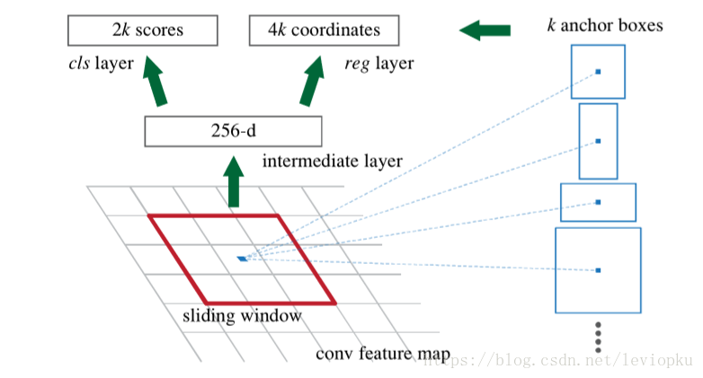

   - 第二步，“下锚”以后开始撒网，即以每一个锚点为中心生成大小不同的k个框。原文中选用的k=9。九个大小形状不一的框，致力于使目标对象能出现在某个框中。框的大小也是有讲究的，长宽比1:1，2:1，1:2三种，大小也有三种。如下图:
  
    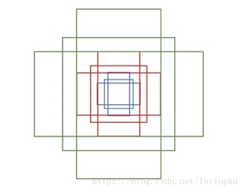

2. **Bounding box regression**

    如果把跟GT最接近的框当作输出，那么结果肯定是非常粗糙的，大小比例很难跟GT一样。所以就需要调整这个框，平移或者缩放。如下图：

    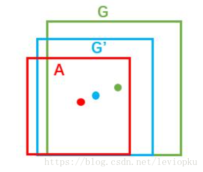

    A是你的anchor，G’是你调整后的，G是GroundTruth。那么对A的这个调整，就是Bounding Box回归。

    回归算法就是用线性函数去拟合实际函数，y=wxy=wx，乍看起来就像弱智版的全连接网络。当你的bbox和GT比较接近时，调整框操作才可以使用线性回归模型

    我们粗粒度探讨一下线性回归模型的操作： 

      1. 回归模型的作用：微调整bbox的位置和大小。每个bbox可以由四个数值来表示(中点坐标x,y和长宽l,w)。平移bbox只需在x,y上作加减，调整大小只需在l,w上作乘法。 
      2. 回归模型的输出：x,y上的增量以及l,w的系数。即，输出也是4个值。 
   
      3. 回归模型的输入：bbox在feature maps上划下的区域。
   
   举个例子

   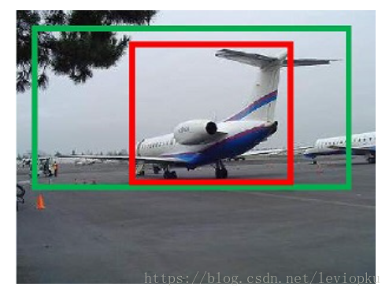

    红色框是anchor框，蓝色框时GT。现在要通过回归模型调整anchor到GT的样子。 

    输出是：调整平移和缩放的四个数值。

**总结**：不知道到这一步有没有一种感觉，输入一个飞机体，就可以想象它的机翼部分的范围应该在哪里。而回归模型就做了这么一件事。

前面卷积层已经把把特征高度抽象化了，这里的回归模型只是根据特征来输出调整值。所以这么强大的调整功能，也是有卷积的功劳的。

### 11、Focal loss

1. 总述
   
   **Focal loss**主要是为了解决one-stage目标检测中正负样本比例严重失衡的问题。该损失函数降低了大量简单负样本在训练中所占的权重，也可理解为一种困难样本挖掘。
<br>
2. 损失函数形式
    Focal loss是在交叉熵损失函数基础上进行的修改，首先回顾二分类交叉上损失：

$$
\mathrm{L}=-\mathrm{y} \log \mathrm{y}^{\prime}-(1-y) \log \left(1-y^{\prime}\right)=\left\{\begin{array}{cc}{-\log y^{\prime}} & {y=1} \\ {-\log \left(1-y^{\prime}\right),} & {y=0}\end{array}\right.
$$

$y^{\prime}$是经过激活函数的输出，所以在0-1之间。可见普通的交叉熵对于正样本而言，输出概率越大损失越小。对于负样本而言，输出概率越小则损失越小。此时的损失函数在大量简单样本的迭代过程中比较缓慢且可能无法优化至最优。那么Focal loss是怎么改进的呢？
    
$$
\mathrm{L}_{f l}=\left\{\begin{array}{ll}{-\left(1-y^{\prime}\right)^{\gamma} \log y^{\prime}} & {, \quad y=1} \\ {-y^{\prime \gamma} \log \left(1-y^{\prime}\right),} & {y=0}\end{array}\right.
$$

首先在原有的基础上加了一个因子，其中gamma>0使得减少易分类样本的损失。使得更关注于困难的、错分的样本。
<br>

例如$\gamma$为2，对于正类样本而言，预测结果为0.95肯定是简单样本，所以（1-0.95）的$\gamma$次方就会很小，这时损失函数值就变得更小。而预测概率为0.3的样本其损失相对很大。对于负类样本而言同样，预测0.1的结果应当远比预测0.7的样本损失值要小得多。对于预测概率为0.5时，损失只减少了0.25倍，所以更加关注于这种难以区分的样本。这样减少了简单样本的影响，大量预测概率很小的样本叠加起来后的效应才可能比较有效。
<br>
此外，加入平衡因子alpha，用来平衡正负样本本身的比例不均：

$$
\mathrm{L}_{f l}=\left\{\begin{array}{ll}{-\alpha\left(1-y^{\prime}\right)^{\gamma} \log y^{\prime}} & {y=1} \\ {-(1-\alpha) y^{\prime \gamma} \log \left(1-y^{\prime}\right),} & {y=0}\end{array}\right.
$$

只添加$\alpha$虽然可以平衡正负样本的重要性，但是无法解决简单与困难样本的问题。$\gamma$调节简单样本权重降低的速率，当$\gamma$为0时即为交叉熵损失函数，当$\gamma$增加时，调整因子的影响也在增加。实验发现$\gamma$为2是最优。
<br>

3. 总结

    作者认为one-stage和two-stage的表现差异主要原因是大量前景背景类别不平衡导致。作者设计了一个简单密集型网络RetinaNet来训练在保证速度的同时达到了精度最优。在双阶段算法中，在候选框阶段，通过得分和nms筛选过滤掉了大量的负样本，然后在分类回归阶段又固定了正负样本比例，或者通过OHEM在线困难挖掘使得前景和背景相对平衡。而one-stage阶段需要产生约100k的候选位置，虽然有类似的采样，但是训练仍然被大量负样本所主导。

### 12、深度可分离卷积

深度可分离卷积将传统的卷积分解为一个深度卷积（depthwise convolution）+ 一个 1×1的卷积（pointwise convolution）。如下图所示，(a)是传统卷积，(b)、(c)分别对应深度可分离卷积的深度卷积和 1×1的卷积：

   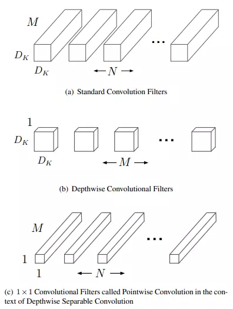

假设输入特征图大小为 $D_{f} \times D_{f} \times M$，输出特征图大小为 $D_{f} \times D_{f} \times N$，卷积核大小为 $D_{k} \times D_{k}$.

则**传统卷积的计算量**为：

$$
D_{k} \times D_{k} \times M \times N \times D_{f} \times D_{f}
$$

**深度可分离卷积的计算量**为深度卷积和 1×1 卷积的计算量之和：

$$
D_{k} \times D_{k} \times M \times D_{f} \times D_{f}+M \times N \times D_{f} \times D_{f}
$$

深度可分离卷积与传统卷积的**计算量之比**为：

$$
\frac{D_{k} \times D_{k}+N}{D_{k} \times D_{k} \times N}
$$

以 28×28×192 的输入，28×28×256 的输出为例，卷积核大小为 3×3，两者的计算量之比为：

$$
\frac{3 \times 3+256}{3 \times 3 \times 256}=0.1150
$$

深度可分离卷积的计算量缩减为传统卷积的 1/9 左右。


[参考](https://zhuanlan.zhihu.com/p/35405071)

### 13、卷积神经网络参数量计算

在CNN中,每层有两种类型的参数:weights 和biases.总参数数量为所有weights和biases的总和.

#### 卷积层参数数量计算

$W_{c}$=卷积层的weights数量

$B_{c}$=卷积层的biases数量

$P_{c}$=所有参数的数量

$K$=核尺寸

$N$=核数量

$C$=输入图像通道数

卷积层中,核的深度等于输入图像的通道数.于是每个核有$K \times K$个参数.并且有$N$个核.由此得出以下的公式:

$$
W_{c}=K \times K \times C \times N
$$

$$
B_{c}=N
$$

$$
P_{c}=(K \times K \times C+1) \times N
$$

示例：AlexNet网络中,第1个卷积层,输入图像的通道数C是3,核尺寸K是11*11,核数量是96. 该层的参数计算如下：

$$
\begin{aligned} W_{c} &=11 \times 11 \times 3 \times 96 \\ B_{c} &=96 \\ P_{c} &=(11 \times 11 \times 3+1) \times 96=34944 \end{aligned}
$$

#### Fully Connected (FC) Layer参数数量

在CNN中有两种类型的全连接层.

- 第1种是连接到最后1个卷积层
  
- 另外1种的FC层是连接到其他的FC层.两种情况我们分开讨论.

**类型1：连接到Conv Layer**

定义如下:

$W_{cf}$= weights的数量

$B_{cf}$= biases的数量

$O$= 前卷积层的输出图像的尺寸

$N$ = 前卷积层的核数量

$F$ = 全连接层的神经元数量

$$
W_{c f}=O \times O \times N \times F
$$

$$
B_{c}=F
$$

$$
P_{c}=(O \times O \times N+1) \times F
$$

示例: AlexNet网络中第1个FC层连接至Conv Layer.该层的O为6, N为256, F为4096.

$$
\begin{array}{l}{W_{c f}=6 \times 6 \times 256 \times 4096=37748736} \\ {B_{c f}=4096} \\ {P_{c f}=(6 \times 6 \times 256+1) \times 4096=37752832}\end{array}
$$

参数数目远大于所有Conv Layer的参数和.

**类型2：连接到FC Layer**

$W_{ff}$= weights的数量

$B_{ff}$= biases的数量

$B_{ff}$= 总参数的数量

$F$= 当前FC层的神经元数量

$F_{-1}$ = 前FC层的神经元数量

$$
W_{f f}=F_{-1} \times F
$$

$$
B_{f f}=F
$$

$$
P_{f f}=W_{f f}+B_{f f}
$$

示例:AlexNet的最后1个全连接层,   $F_{-1}$=4096, $F$=1000 .

$$
\begin{array}{l}{W_{f f}=4096 \times 1000=4096000} \\ {B_{f f}=1000} \\ {P_{f f}=4096000+1000=4097000}\end{array}
$$

### 14、为什么VGG要用3*3的卷积核

- 3x3是最小的能够捕获像素八邻域信息的尺寸。
  
- 两个3x3的堆叠卷积层的有限感受野是5x5；三个3x3的堆叠卷积层的感受野是7x7，故可以通过小尺寸卷积层的堆叠替代大尺寸卷积层，并且感受野大小不变。
  
- 多个3x3的卷基层比一个大尺寸filter卷基层有更多的非线性（更多层的非线性函数），使得判决函数更加具有判决性。
  
- 多个3x3的卷积层比一个大尺寸的filter有更少的参数，假设卷基层的输入和输出的特征图大小相同为C，那么三个3x3的卷积层参数个数3x（3x3xCxC）$=27 \mathrm{C}^{2}$；一个7x7的卷积层参数为$=49 \mathrm{C}^{2}$；所以可以把三个3x3的filter看成是一个7x7filter的分解（中间层有非线性的分解, 并且起到隐式正则化的作用。

### 15、1×1卷积的作用？

- 进行卷积核通道数的降维和升维，减少网络参数。
  
- 实现跨通道的交互和信息整合
  
- 加入非线性。卷积层之后经过激励层，1*1的卷积在前一层的学习表示上添加了非线性激励（ non-linear activation ），提升网络的表达能力。


### 16、为什么One-stage在精度上逊色于twp-stage，但是速度完胜？

one-stage受制于万恶的 “类别不平衡”

1. 什么是“类别不平衡”呢？

详细来说，检测算法在早期会生成一大波的bbox。而一幅常规的图片中，顶多就那么几个object。这意味着，绝大多数的bbox属于background。
<br>

2. “类别不平衡”又如何会导致检测精度低呢？

因为bbox数量爆炸。正是因为bbox中属于background的bbox太多了，所以如果分类器无脑地把所有bbox统一归类为background，accuracy也可以刷得很高。于是乎，分类器的训练就失败了。分类器训练失败，检测精度自然就低了。
<br>

3. 那为什么two-stage系就可以避免这个问题呢？

因为two-stage系有RPN罩着。 

第一个stage的RPN会对anchor进行简单的二分类（只是简单地区分是前景还是背景，并不区别究竟属于哪个细类）。经过该轮初筛，属于background的bbox被大幅砍削。虽然其数量依然远大于前景类bbox，但是至少数量差距已经不像最初生成的anchor那样夸张了。就等于是 从 “类别 极 不平衡” 变成了 “类别 较 不平衡” 。 
    
不过，其实two-stage系的detector也不能完全避免这个问题，只能说是在很大程度上减轻了“类别不平衡”对检测精度所造成的影响。 
    
接着到了第二个stage时，分类器登场，在初筛过后的bbox上进行难度小得多的第二波分类(这次是细分类)。这样一来，分类器得到了较好的训练，最终的检测精度自然就高啦。但是经过这么两个stage一倒腾，操作复杂，检测速度就被严重拖慢了。
<br>

4. 那为什么one-stage系无法避免该问题呢？

因为one stage系的detector直接在首波生成的“类别极不平衡”的bbox中就进行难度极大的细分类，意图直接输出bbox和标签（分类结果）。而原有交叉熵损失(CE)作为分类任务的损失函数，无法抗衡“类别极不平衡”，容易导致分类器训练失败。因此，one-stage detector虽然保住了检测速度，却丧失了检测精度。

### 17、RetinaNet

RetinaNet就是一个FPN-based的one-stage detector，靠着最后面的focal loss来解决由于过量background而引起的类别不平衡。

RetinaNet的特点主要是：

1. new cls loss：Focal Loss 
   
$$
F L\left(p_{t}\right)=-\left(1-p_{t}\right)^{\gamma} \log \left(p_{t}\right)
$$

2. new network：RetinaNet
<br>
    >RetinaNet = FPN + sub-network + FL

### 18、YOLOv2和YOLOv3的区别

1. loss不同
   v3替换了v2的softmax loss 变成logistic loss，而且每个ground truth只匹配一个先验框。 

2. 网络结构改变： 
   由darknet19变为darknet53，跳层现象越来越普遍，使用残差结构。 

3. 激活函数不同
   
   激活函数由softmax改为sigmoid 

4. anchor数量不同
   anchor的数量由5个变为3个，提高了IOU 

5. detection的策略不同
   v2只有一个detection，v3一下变成了3个，分别是一个下采样的，feature map为13*13，还有2个上采样的eltwise sum，feature map为26*26，52*52，也就是说v3的416版本已经用到了52的feature map，而v2把多尺度考虑到训练的data采样上，最后也只是用到了13的feature map，这应该是对小目标影响最大的地方。 

6. backbone不同
   这和上一点是有关系的，v2的darknet-19变成了v3的darknet-53，为啥呢？就是需要上采样啊，卷积层的数量自然就多了，另外作者还是用了一连串的3*3、1*1卷积，3*3的卷积增加channel，而1*1的卷积在于压缩3*3卷积后的特征表示，这波操作很具有实用性，一增一减，效果很棒。


### 19、CNN的本质是什么？

局部卷积+Pooling

参考：

[卷积神经网络(CNN)基础介绍](https://blog.csdn.net/fengbingchun/article/details/50529500)

### 20、池化层如何反向传播

**平均池化（Mean Pooling）**

mean pooling的前向传播就是把一个patch中的值求取平均来做pooling，那么反向传播的过程也就是把某个元素的梯度等分为n份分配给前一层，这样就保证池化前后的梯度（残差）之和保持不变，还是比较理解的。

**最大池化（Max Pooling）**

max pooling也要满足梯度之和不变的原则，max pooling的前向传播是把patch中最大的值传递给后一层，而其他像素的值直接被舍弃掉。那么反向传播也就是把梯度直接传给前一层某一个像素，而其他像素不接受梯度，也就是为0。所以max pooling操作和mean pooling操作不同点在于需要记录下池化操作时到底哪个像素的值是最大，也就是max id，这个可以看caffe源码的pooling_layer.cpp


参考:
[深度学习笔记（3）——CNN中一些特殊环节的反向传播](https://blog.csdn.net/qq_21190081/article/details/72871704)

### 21、ResNet

**1.ResNet意义**

随着网络的加深，出现了训练集准确率下降的现象，我们可以确定这不是由于Overfit过拟合造成的(过拟合的情况训练集应该准确率很高)；所以作者针对这个问题提出了一种全新的网络，叫深度残差网络，它允许网络尽可能的加深，其中引入了全新的结构如图1； 


**残差指的是什么**？ 
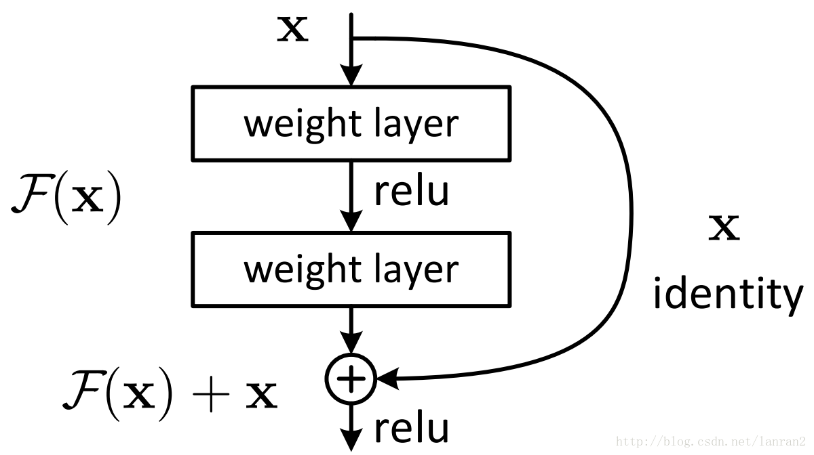


其中ResNet提出了两种mapping：一种是identity mapping，指的就是图1中”弯弯的曲线”，另一种residual mapping，指的就是除了”弯弯的曲线“那部分，所以最后的输出是 $y=F(x)+x$ 

identity mapping顾名思义，就是指本身，也就是公式中的x，而residual mapping指的是“差”，也就是y−x，所以残差指的就是F(x)部分。 

**为什么ResNet可以解决“随着网络加深，准确率不下降”的问题？** 


理论上，对于“随着网络加深，准确率下降”的问题，Resnet提供了两种选择方式，也就是identity mapping和residual mapping，如果网络已经到达最优，继续加深网络，residual mapping将被push为0，只剩下identity mapping，这样理论上网络一直处于最优状态了，网络的性能也就不会随着深度增加而降低了。
 
参考：

- [ResNet解析](https://blog.csdn.net/lanran2/article/details/79057994)

- [ResNet论文笔记](https://blog.csdn.net/wspba/article/details/56019373)

- [残差网络ResNet笔记](https://www.jianshu.com/p/e58437f39f65)

- [Understand Deep Residual Networks — a simple, modular learning framework that has redefined state-of-the-art](https://blog.waya.ai/deep-residual-learning-9610bb62c355)


- [An Overview of ResNet and its Variants](https://towardsdatascience.com/an-overview-of-resnet-and-its-variants-5281e2f56035)     
 
[译文](https://www.jianshu.com/p/46d76bd56766)

- [Understanding and Implementing Architectures of ResNet and ResNeXt for state-of-the-art Image Classification: From Microsoft to Facebook [Part 1]](https://medium.com/@14prakash/understanding-and-implementing-architectures-of-resnet-and-resnext-for-state-of-the-art-image-cf51669e1624)

- [给妹纸的深度学习教学(4)——同Residual玩耍](https://zhuanlan.zhihu.com/p/28413039)

### 22、FCN

一句话概括就是：FCN将传统网络后面的全连接层换成了卷积层，这样网络输出不再是类别而是 heatmap；同时为了解决因为卷积和池化对图像尺寸的影响，提出使用上采样的方式恢复。


作者的FCN主要使用了三种技术：

- 卷积化（Convolutional）

- 上采样（Upsample）

- 跳跃结构（Skip Layer）


**卷积化**

卷积化即是将普通的分类网络，比如VGG16，ResNet50/101等网络丢弃全连接层，换上对应的卷积层即可。


**上采样**

此处的上采样即是反卷积（Deconvolution）。当然关于这个名字不同框架不同，Caffe和Kera里叫Deconvolution，而tensorflow里叫conv_transpose。CS231n这门课中说，叫conv_transpose更为合适。

众所诸知，普通的池化（为什么这儿是普通的池化请看后文）会缩小图片的尺寸，比如VGG16 五次池化后图片被缩小了32倍。为了得到和原图等大的分割图，我们需要上采样/反卷积。

反卷积和卷积类似，都是相乘相加的运算。只不过后者是多对一，前者是一对多。而反卷积的前向和后向传播，只用颠倒卷积的前后向传播即可。所以无论优化还是后向传播算法都是没有问题。


**跳跃结构（Skip Layers）**

（这个奇怪的名字是我翻译的，好像一般叫忽略连接结构）这个结构的作用就在于优化结果，因为如果将全卷积之后的结果直接上采样得到的结果是很粗糙的，所以作者将不同池化层的结果进行上采样之后来优化输出。


上采样获得与输入一样的尺寸

文章采用的网络经过5次卷积+池化后，图像尺寸依次缩小了 2、4、8、16、32倍，对最后一层做32倍上采样，就可以得到与原图一样的大小

作者发现，仅对第5层做32倍反卷积（deconvolution），得到的结果不太精确。于是将第 4 层和第 3 层的输出也依次反卷积


**FCN的优点和不足**


FCN 的优势在于： 

- 可以接受任意大小的输入图像（没有全连接层） 
  
- 更加高效，避免了使用邻域带来的重复计算和空间浪费的问题

**其不足也很突出：** 

- 得到的结果还不够精细 
  
- 没有充分考虑像素之间的关系，缺乏空间一致性

参考：

[【总结】图像语义分割之FCN和CRF](https://zhuanlan.zhihu.com/p/22308032)

[图像语义分割（1）- FCN](https://blog.csdn.net/zizi7/article/details/77093447)

[全卷积网络 FCN 详解](https://www.cnblogs.com/gujianhan/p/6030639.html)

### 23、Accuracy、Precision、Recall和F1 Score

在学习机器学习、深度学习，甚至做自己项目的时候，经过看到上述名词。然而因为名词容易搞混，所以经常会忘记相关的含义。

这里做一次最全最清晰的介绍，若之后再次忘记相关知识点，本文可以帮助快速回顾。

首先，列出一个清单：

- TP（true positive，真正）: 预测为正，实际为正

- FP（false positive，假正）: 预测为正，实际为负

- TN（true negative，真负）：预测为负，实际为负

- FN（false negative，假负）: 预测为负，实际为正

- ACC（accuracy，准确率）：ACC = (TP+TN)/(TP+TN+FN+FP)

- P（precision精确率、精准率、查准率P = TP/ (TP+FP)

- R（recall，召回率、查全率）： R = TP/ (TP+FN)

- TPR（true positive rate，，真正类率同召回率、查全率）：TPR = TP/ (TP+FN)

    注：Recall = TPR

- FPR（false positive rate，假正类率）：FPR =FP/ (FP+TN)

- F-Score: F-Score = (1+β^2) x (PxR) / (β^2x(P+R)) = 2xTP/(2xTP + FP + FN)

- 当β=1是，F1-score = 2xPxR/(P+R)

- P-R曲线（precision-recall，查准率-查全率曲线）

- ROC曲线（receiver operating characteristic，接收者操作特征曲线）

- AUC（area under curve）值


中文博大精深，为了不搞混，下面统一用英文全称或简称作为名词标识。


正式介绍一下前四个名词：

**True positives（TP，真正）** : 预测为正，实际为正

**True negatives（TN，真负）**：预测为负，实际为负

**False positives（FP，假正**）: 预测为正，实际为负 

**False negatives（FN，假负）**: 预测为负，实际为正


为了更好的理解，这里二元分类问题的例子：


假设，我们要对某一封邮件做出一个判定，判定这封邮件是垃圾邮件、还是这封邮件不是垃圾邮件？

如果判定是垃圾邮件，那就是做出（Positive）的判定； 

如果判定不是垃圾邮件，那就做出（Negative）的判定。

True Positive（TP）意思表示做出Positive的判定，而且判定是正确的。

因此，TP的数值表示正确的Positive判定的个数。 

同理，False Positive（TP）数值表示错误的Positive判定的个数。 

依此，True Negative（TN）数值表示正确的Negative判定个数。 

False Negative（FN）数值表示错误的Negative判定个数。


**TPR、FPR和TNR**

**TPR（true positive rate，真正类率）**

TPR = TP/(TP+FN)

真正类率TPR代表分类器预测的正类中实际正实例占所有正实例的比例。


**FPR（false positive rate，假正类率）**

FPR = FP/(FP+TN)

假正类率FPR代表分类器预测的正类中实际负实例占所有负实例的比例。


**TNR（ture negative rate，真负类率）**

TNR = TN/(FP+TN)

真负类率TNR代表分类器预测的负类中实际负实例占所有负实例的比例。


**Accuracy**

准确率（accuracy，ACC）

ACC = (TP+TN)/(TP+TN+FN+FP)


**Precision & Recall**

[Precision精确率](https://en.wikipedia.org/wiki/Precision_and_recall)：

P = TP/(TP+FP)

表示当前划分到正样本类别中，被正确分类的比例（正确正样本所占比例）。


[Recall召回率](https://en.wikipedia.org/wiki/Precision_and_recall)：

R = TP/(TP+FN)

表示当前划分到正样本类别中，真实正样本占所有正样本的比例。

**F-Score**

F-Score 是精确率Precision和召回率Recall的加权调和平均值。该值是为了综合衡量Precision和Recall而设定的。

F-Score = (1+β^2) x (PxR) / (β^2x(P+R)) = 2xTP/(2xTP + FP + FN)

当β=1时，F1-score = 2xPxR/(P+R)。这时，Precision和Recall都很重要，权重相同。

当有些情况下，我们认为Precision更重要，那就调整β的值小于1；如果我们认为Recall更加重要，那就调整β的值大于1。

一般来说，当F-Score或F1-score较高


**P-R曲线**


**ROC曲线**

横轴：负正类率(false postive rate FPR)

纵轴：真正类率(true postive rate TPR)


**AUC值**


上面都是理论，看起来很迷糊，这里举个真实应用的实例，加强理解。


对于那些不熟悉的人，我将解释精确度和召回率，对于那些熟悉的人，我将在比较精确召回曲线时解释文献中的一些混淆。


下面从图像分类的角度举个例子：

假设现在有这样一个测试集，测试集中的图片只由大雁和飞机两种图片组成，如下图所示： 


假设你的分类系统最终的目的是：能取出测试集中所有飞机的图片，而不是大雁的图片。

现在做如下的定义： 

True positives（TP，真正） : 飞机的图片被正确的识别成了飞机。 

True negatives（TN，真负）: 大雁的图片没有被识别出来，系统正确地认为它们是大雁。 

False positives（FP，假正）: 大雁的图片被错误地识别成了飞机。 

False negatives（FN，假负）: 飞机的图片没有被识别出来，系统错误地认为它们是大雁。


参考

[Accuracy, Precision, Recall & F1 Score: Interpretation of Performance Measures](http://blog.exsilio.com/all/accuracy-precision-recall-f1-score-interpretation-of-performance-measures/)

[Precision and recall](https://en.wikipedia.org/wiki/Precision_and_recall)

[average precision](https://sanchom.wordpress.com/tag/average-precision/)

[Precision-Recall](http://scikit-learn.org/stable/auto_examples/model_selection/plot_precision_recall.html)

[【YOLO学习】召回率（Recall），精确率（Precision），平均正确率（Average_precision(AP) ），交除并（Intersection-over-Union（IoU））](https://blog.csdn.net/hysteric314/article/details/54093734)

[https://blog.csdn.net/u014380165/article/details/77493978](Precision，Recall，F1score，Accuracy的理解)


[ROC、Precision、Recall、TPR、FPR理解](https://www.jianshu.com/p/be2e037900a1)

[推荐系统评测指标—准确率(Precision)、召回率(Recall)、F值(F-Measure) ](http://bookshadow.com/weblog/2014/06/10/precision-recall-f-measure/)

[机器学习之分类器性能指标之ROC曲线、AUC值](http://www.cnblogs.com/dlml/p/4403482.html)


### 24、ROI Pooling、ROI Align

**RoIPooling**

这个可以在Faster RCNN中使用以便使生成的候选框region proposal映射产生固定大小的feature map

先贴出一张图，接着通过这图解释RoiPooling的工作原理   

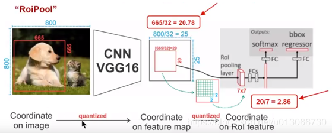

针对上图

- Conv layers使用的是VGG16，feat_stride=32(即表示，经过网络层后图片缩小为原图的1/32),原图800*800,最后一层特征图feature map大小:25*25

- 假定原图中有一region proposal，大小为665*665，这样，映射到特征图中的大小：665/32=20.78,即20.78*20.78，如果你看过Caffe的Roi Pooling的C++源码，在计算的时候会进行取整操作，于是，进行所谓的第一次量化，即映射的特征图大小为20*20

- 假定pooled_w=7,pooled_h=7,即pooling后固定成7*7大小的特征图，所以，将上面在 feature map上映射的20*20的 region  proposal划分成49个同等大小的小区域，每个小区域的大小20/7=2.86,即2.86*2.86，此时，进行第二次量化，故小区域大小变成2*2

- 每个2*2的小区域里，取出其中最大的像素值，作为这一个区域的‘代表’，这样，49个小区域就输出49个像素值，组成7*7大小的feature map

总结，所以，通过上面可以看出，经过两次量化，即将浮点数取整，原本在特征图上映射的20*20 大小的region proposal，偏差成大小为14*14的，这样的像素偏差势必会对后层的回归定位产生影响

所以，产生了替代方案，RoiAlign。

**RoiAlign**

这个是在Mask RCNN中使用以便使生成的候选框region proposal映射产生固定大小的feature map时提出的

先贴出一张图，接着通过这图解释RoiAlign的工作原理

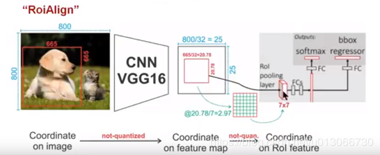

同样，针对上图，有着类似的映射

- Conv layers使用的是VGG16，feat_stride=32(即表示，经过网络层后图片缩小为原图的1/32),原图800*800,最后一层特征图feature map大小:25*25

- 假定原图中有一region proposal，大小为665*665，这样，映射到特征图中的大小：665/32=20.78,即20.78*20.78，此时，没有像RoiPooling那样就行取整操作，保留浮点数

- 假定pooled_w=7,pooled_h=7,即pooling后固定成7*7大小的特征图，所以，将在 feature map上映射的20.78*20.78的region proposal 划分成49个同等大小的小区域，每个小区域的大小20.78/7=2.97,即2.97*2.97

- 假定采样点数为4，即表示，对于每个2.97*2.97的小区域，平分四份，每一份取其中心点位置，而中心点位置的像素，采用双线性插值法进行计算，这样，就会得到四个点的像素值，如下图

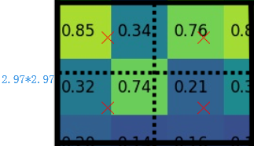

上图中，四个红色叉叉‘×’的像素值是通过双线性插值算法计算得到的。

最后，取四个像素值中最大值作为这个小区域(即：2.97*2.97大小的区域)的像素值，如此类推，同样是49个小区域得到49个像素值，组成7*7大小的feature map

    

**总结**：知道了RoiPooling和RoiAlign实现原理，在以后的项目中可以根据实际情况进行方案的选择；对于检测图片中大目标物体时，两种方案的差别不大，而如果是图片中有较多小目标物体需要检测，则优先选择RoiAlign，更精准些。

### 25、ResNet v1与ResNet v2的区别

ResNet V2 和 ResNet V1 的主要区别在于，作者通过研究 ResNet 残差学习单元的传播公式，发现前馈和反馈信号可以直接传输，因此“shortcut connection”（捷径连接）的非线性激活函数（如ReLU）替换为 Identity Mappings。同时，ResNet V2 在每一层中都使用了 Batch Normalization。这样处理后，新的残差学习单元比以前更容易训练且泛化性更强。

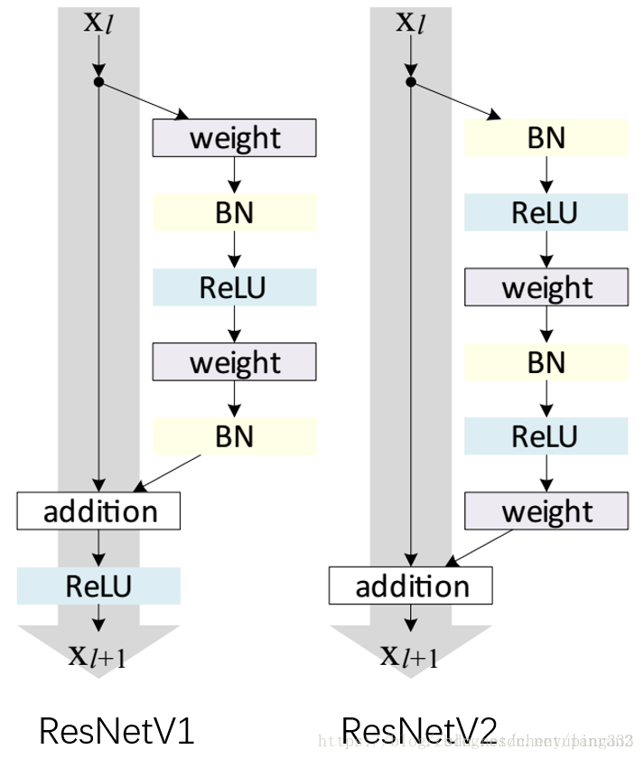

### 26、优化方法


#### 梯度下降法的三种形式BGD、SGD以及MBGD

  - [批量梯度下降法BGD](https://www.cnblogs.com/maybe2030/p/5089753.html#_label0)
  
  - [随机梯度下降法SGD](https://www.cnblogs.com/maybe2030/p/5089753.html#_label0)
  
  - [小批量梯度下降法MBGD](https://www.cnblogs.com/maybe2030/p/5089753.html#_label0)

1. **批量梯度下降法**（Batch Gradient Descent，简称BGD）是梯度下降法最原始的形式，它的具体思路是在更新每一参数时都使用所有的样本来进行更新。
   
   - 优点：全局最优解；易于并行实现；
  
   - 缺点：当样本数目很多时，训练过程会很慢。
  
2. **随机梯度下降法SGD**：由于批量梯度下降法在更新每一个参数时，都需要所有的训练样本，所以训练过程会随着样本数量的加大而变得异常的缓慢。随机梯度下降法（Stochastic Gradient Descent，简称SGD）正是为了解决批量梯度下降法这一弊端而提出的。
    - 优点：训练速度快；
  
    - 缺点：准确度下降，并不是全局最优；不易于并行实现。
  
3. **小批量梯度下降法MBGD**：有上述的两种梯度下降法可以看出，其各自均有优缺点，那么能不能在两种方法的性能之间取得一个折衷呢？即，算法的训练过程比较快，而且也要保证最终参数训练的准确率，而这正是小批量梯度下降法（Mini-batch Gradient Descent，简称MBGD）的初衷。

#### 总结
   - Batch gradient descent: Use all examples in each iteration； 
  
   - Stochastic gradient descent: Use 1 example in each iteration；
   
   - Mini-batch gradient descent: Use b examples in each iteration.

#### SGD存在的问题：
   - 各方向的梯度差较大，进展缓慢。
   
   - 易陷入局部极小点
   
   - 鞍点在高维空间中更为常见
   
   - 噪声严重

#### SGD改进及变种
 
##### 1: SGD + Momentum：
   
    > 引入速度的概念：引入“速度”作为梯度的运行平均值；通常$\rho$ = 0.9 or 0.99。有效解决了SGD的噪声、、极小点、速度和鞍点问题


SGD迭代方式：


$x_{t+1}=x_{t}-\alpha \nabla f\left(x_{t}\right)$


**代码：**


```
while True:
    dx = compute_gradient(x)
    x += learning_rate * dx
```
SGD + Momentum迭代方式：


$v_{t+1}=\rho v_{t}+\nabla f\left(x_{t}\right)$

$x_{t+1}=x_{t}-\alpha v_{t+1}$


**代码：**
```
vx = 0
while True:
    dx = compute_gradient(x)
    vx = rho * vx + dx
    x += learning_rate * vx
```
##### 2：Nesterov Momentum

> 理论上对于凸函数它能得到更好的收敛，在实践中也确实比标准动量表现更好一些。

Nesterov Momentum迭代方式

$v_{t+1}=\rho v_{t}-\alpha \nabla f\left(x_{t}+\rho v_{t}\right)$

$x_{t+1}=x_{t}+v_{t+1}$


**代码：**

```
while True：
    dx = compute_gradient(x)
    old_v = v
    v = rho * v - learning_rate * dx
    x += -rho * old_v + (1 + rho) * v
```

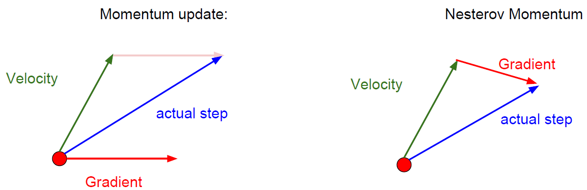

##### 3：Adagrad

> 是一个适应性学习率算法。

```
grad_squared = 0
while True:
    dx = compute_gradient(x)
    grad_squared += dx * dx
    x -= learning_rate *dx / (np.sqrt(grad_squared) + 1e-7)
```

使用了Adagrad，步长会变得越来越小，因为一直在随时间更新梯度平方的估计值，所以这个估计值，一直随时间单调递增，会导致学习率随着时间越来越小。

- **优点**：在凸函数中Adagrad效果很好，当接近极点时，会逐渐的慢下来，最后到达收敛。
- **缺点**：在非凸函数时，事情会变得复杂，当到达一个局部极值点时，使用Adagrad会被困在这里，从而使训练过程无法继续。

##### 4：RMSprop

**RMSProp**是一个非常高效，但没有公开发表的适应性学习率方法。这个方法用一种很简单的方式修改了Adagrad方法，让它不那么激进，单调地降低了学习率。具体说来，就是它使用了一个梯度平方的滑动平均。

**代码**

```
grad_squared = 0
while True:
    dx = compute_gradient(x)
    grad_squared = decay_rate * grad_squared + (1 - decay_rate) * dx * dx
    x -= learning_rate * dx / (np.sqrt(grad_squared) + 1e-7)
```

##### 5: ADAM

看起来像是RMSProp的动量版本

**代码**

```
first_moment = 0
second_moment = 0
while True:
    dx = compute_gradient(x)
    first_moment = beta1 * first_moment + (1 - beta1) * dx
    second_moment = beta2 * second_moment + (1 - beta2) * dx * dx        # Momentum
    x -= learning_rate * first_moment / (np.sqrt(second_moment) + 1e-7)  # AdaGrad / RMSProp
```

Adam完整的算法包含偏置项，以避免开始时出现很大的步长。


```
first_moment = 0
second_moment = 0
for t in range(num_iteration):
    dx = compute_gradient(x)
    first_moment = beta1 * first_moment + (1 - beta1) * dx
    second_moment = beta2 * second_moment + (1 - beta2) * dx * dx        # Momentum
    first_unbias = first_moment / (1 - beta1 ** t)
    second_unbias = second_moment / (1 - beta2 ** t)                     # bias correction
    x -= learning_rate * first_moment / (np.sqrt(second_moment) + 1e-7)  # AdaGrad / RMSProp
```

> Adam的超参数一般设置为```beta1 = 0.9，beta2 = 0.999，learning_rate = 1e-3 或者5e-4```，对任何模型来说，都是一个不错的开始

##### 学习率衰减的方法

**1**：**指数衰减**：

$\alpha=\alpha_{0} e^{-k t}$

**2**：**1/t** **衰减**

$\alpha=\alpha_{0} /(1+k t)$


##### 二阶优化方法

1. 利用梯度和Hessian函数形成二次逼近
   
2. 求近似的最小值
    - 优点：不需要学习率，没有超参数
    - 缺点：计算量庞大


##### L-BFGS方法

通常在全批次、确定性模式下工作得很好。如果你有一个单一的，确定性的f(x)那么L-BFGS可能会很好地工作。不能很好地转移到小批量设置。给了坏的结果。将L-BFGS应用于大规模随机环境是当前研究的热点。

在深度学习和卷积神经网络中，使用L-BFGS之类的二阶方法并不常见。相反，基于（Nesterov的）动量更新的各种随机梯度下降方法更加常用，因为它们更加简单且容易扩展。

##### 模型集成

- 训练多个独立模型
- 在测试时平均他们的结果一般会有2%额外表现

##### 总结：

- 在大多数情况下，Adam是一个很好的默认选择
- 如果你可以做完整的批量更新，那么试试L-BFGS(不要忘记禁用所有噪音源)


### 27、网络模型的压缩与量化

综合现有的深度模型压缩方法，它们主要分为四类：

- 参数修剪和共享（parameter pruning and sharing）

- 低秩因子分解（low-rank factorization）

- 转移/紧凑卷积滤波器（transferred/compact convolutional filters）
- 知识蒸馏（knowledge distillation）

基于**参数修剪和共享**的方法针对模型参数的冗余性，试图去除冗余和不重要的项。基于**低秩因子分解**的技术使用矩阵/张量分解来估计深度学习模型的信息参数。基于**传输/紧凑卷积滤波器**的方法设计了特殊的结构卷积滤波器来降低存储和计算复杂度。**知识蒸馏**方法通过学习一个蒸馏模型，训练一个更紧凑的神经网络来重现一个更大的网络的输出。

一般来说，参数修剪和共享，低秩分解和知识蒸馏方法可以用于全连接层和卷积层的CNN，但另一方面，使用转移/紧凑型卷积核的方法仅支持卷积层。低秩因子分解和基于转换/紧凑型卷积核的方法提供了一个端到端的流水线，可以很容易地在CPU/GPU环境中实现。相反参数修剪和共享使用不同的方法，如矢量量化，二进制编码和稀疏约束来执行任务，这导致常需要几个步骤才能达到目标。


方法名称 | 描述   |  应用场景  |方法细节
---|---|---|---
剪枝和共享 | 删除对准确率影响不大的参数 | 卷积层和全连接层| 对不同设置具有鲁棒性，可以达到较好效果，支持从零训练和预训练
低秩分解|使用矩阵对参数进行分解估计	|卷积层和全连接层	|标准化的途径，很容易实施，支持从零训练和预训练
转移、紧凑卷积核|设计特别的卷积核来保存参数	|只有卷积层	|算法依赖于应用程序，通常可以取得好的表现，只能从零开始训练
知识蒸馏|训练一个更紧凑的神经网络来从大的模型蒸馏知识|卷积层和全连接层|模型表现对应用程序和网络结构较为敏感，只能从零开始训练

**关于训练协议**，基于参数修剪/共享、低秩分解的模型可以从预训练模型或者从头开始训练，因此灵活而有效。然而转移/紧凑的卷积核和知识蒸馏模型只能支持从零开始训练。这些方法是独立设计和相辅相成的。例如，转移层和参数修剪和共享可以一起使用，并且模型量化和二值化可以与低秩近似一起使用以实现进一步的加速。不同模型的简要对比，如表1所示。下文针对这些方法做一简单介绍与讨论。

[详细阅读](https://www.cnblogs.com/shixiangwan/p/9015010.html)

### 28、MobileNetV1与MobileNetV2简介

#### 一、参数数量和理论计算量

##### 1、定义

- 参数数量（params）：关系到模型大小，单位通常为M，通常参数用 float32 表示，所以模型大小是参数数量的 4 倍

- 理论计算量（FLOPs）：
  - 是 floating point operations 的缩写（注意 s 小写），可以用来衡量算法/模型的复杂度，这关系到算法速度，大模型的单位通常为 G，小模型单位通常为 M
  - 通常只考虑乘加操作(Multi-Adds)的数量，而且只考虑 CONV 和 FC 等参数层的计算量，忽略 BN 和PReLU 等等。一般情况，CONV 和 FC 层也会 忽略仅纯加操作 的计算量，如 bias 偏���加和 shotcut 残差加等，目前技术有 BN 的 CNN 可以不加 bias

##### 2、计算公式

假设卷积核大小为$K_{h} \times K_{u}$，输入通道数为$C_{i n}$，输出通道数为$C_{o u t}$，输出特征图的宽和高分别为$W$和$H$，这里忽略偏置项

- CONV 标准卷积层：
    - params: $\quad K_{h} \times K_{w} \times C_{i n} \times C_{o u t}$
    
    - FLOP: $K_{h} \times K_{w} \times C_{i n} \times C_{o u t} \times H \times W=$ params $\times H \times W$

- FC 全连接层（相当于 k=1）：
  
  - params: $C_{i n} \times C_{o u t}$
  
  - FLOPs: $C_{i n} \times C_{o u t}$

#### 二、MobileNetV1

##### 1、能够减少参数数量和计算量的原理

- 深度可分离卷积的使用

- Global Average Pooling 的使用：这一层没有参数，计算量可以忽略不计

- 用 CONV/s2（步长2的卷积）代替 MaxPool+CONV：使得参数数量不变，计算量变为原来的 1/4 左右，且省去了MaxPool 的计算量

- Note：采用 depth-wise convolution 会有一个问题，就是导致 信息流通不畅 ，即输出的 feature map 仅包含输入的 feature map 的一部分，在这里，MobileNet 采用了 point-wise(1*1) convolution 帮助信息在通道之间流通

##### 2、MobileNetV1 中引入的两个超参数

- Width Multiplier($\alpha$): Thinner Models
    
    - 所有层的 通道数（channel） 乘以$\alpha$参数(四舍五入)，模型大小近似下降到原来的$\alpha^{2}$倍，计算量下降到原来的$\alpha^{2}$倍
    
    - $\alpha \in(0,1]$ with typical settings of $1,0.75,0.5$ and $0.25,$, 降低模型的宽度

- Resolution Multiplier($\rho$): Reduced Representation
    
    - 输入层的 分辨率（resolution） 乘以$\rho$ 参数 (四舍五入)，等价于所有层的分辨率乘 $\rho$，模型大小不变，计算量下降到原来的$\rho^{2}$倍
    
    - $\rho \in(0,1]$，降低输入图像的分辨率

##### 3、标准卷积和深度可分离卷积的区别

参见第14

#### 三、MobileNetV2

##### 1、主要改进点

- 引入残差结构，先升维再降维，增强梯度的传播，显著减少推理期间所需的内存占用（Inverted Residuals）

- 去掉 Narrow layer（low dimension or depth） 后的 ReLU，保留特征多样性，增强网络的表达能力（Linear Bottlenecks）

- 网络为全卷积的，使得模型可以适应不同尺寸的图像；使用 RELU6（最高输出为 6）激活函数，使得模型在低精度计算下具有更强的鲁棒性

- MobileNetV2 building block 如下所示，若需要下采样，可在 DWise 时采用步长为 2 的卷积；小网络使用小的扩张系数（expansion factor），大网络使用大一点的扩张系数（expansion factor），推荐是5~10，论文中 $t=6$

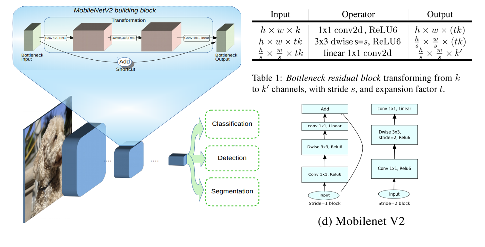

##### 2、和 MobileNetV1 的区别

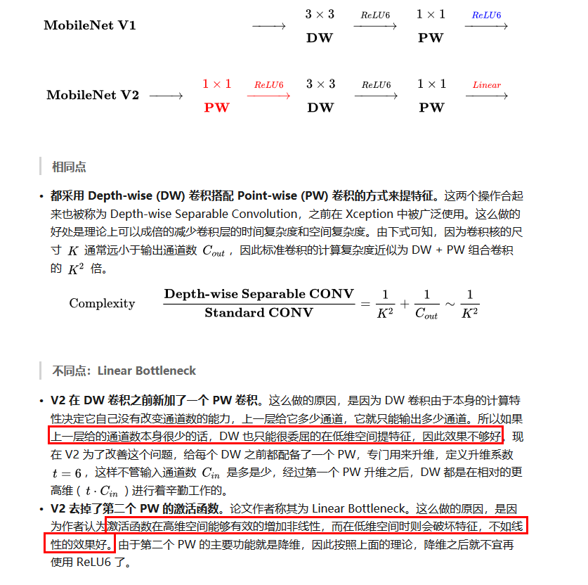

##### 3、和ResNet的区别

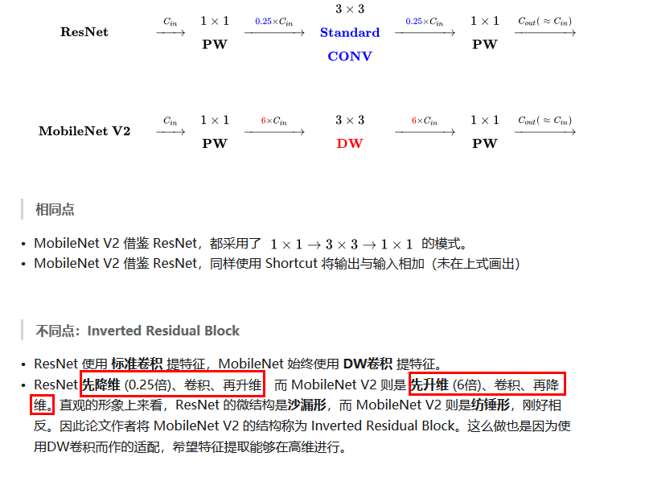


### 29、学习率的调整

- 离散下降(discrete staircase)
  
对于深度学习来说，每 t 轮学习，学习率减半。对于监督学习来说，初始设置一个较大的学习率，然后随着迭代次数的增加，减小学习率。
<br>

- 指数减缓(exponential decay)
  
对于深度学习来说，学习率按训练轮数增长指数差值递减。例如：

    $$
    \alpha=0.95^{\text { epoch}_{-} n u m} \cdot \alpha_{0}
    $$

    又或者公式为：

    $$
    \alpha=\frac{k}{\sqrt{e p o c h_{-} n u m}}
    $$

    其中epoch_num为当前epoch的迭代轮数。不过第二种方法会引入另一个超参$k$ 

<br>

- 分数减缓(1/t decay)
    
    $$
    \alpha=\frac{\alpha}{1+\operatorname{decay}_{rate}* \operatorname{epoch}_{num}}
    $$

    $\operatorname{decay}_{rate}$控制减缓幅度。

[参考](https://zhuanlan.zhihu.com/p/35405071)

### 30、训练样本不均衡的问题

- 扩大数据集

- 尝试其它评价指标 
  
  - 混淆矩阵(Confusion Matrix)：使用一个表格对分类器所预测的类别与其真实的类别的样本统计，分别为：TP、FN、FP与TN。
  
  - 精确度(Precision)
  
  - 召回率(Recall)
  
  - F1得分(F1 Score)：精确度与找召回率的加权平均。
  
  - ROC曲线(ROC Curves)

- 对数据集进行重采样
  
  - 欠采样
  
  - 过采样

- 尝试不同的分类算法  

- 尝试对模型进行惩罚 

### 31、Group convolution？

假设有输入feature map，尺寸为$H \times W \times C$ ，同时有$k$个$h \times w$卷积核。对于一般卷积，输出feature map尺寸为$H^{\prime} \times W^{\prime} \times k$（这里不关心$H^{\prime}$和$W^{\prime}$ ）。

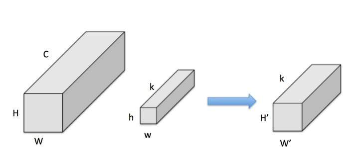

而Group convolution的实质就是将convolution分为$g$个独立的组，分别计算。即：

- 把input feature分为 $g$组，每组尺寸为$H \times W \times(C / g)$，，假设可整除，下同

- 把kernel也分为$g$组，每组尺寸为$h \times w \times(k / g)$

- 按顺序，每组input feature和kernel分别做普通卷积，输出$g$ 组$H^{\prime} \times W^{\prime} \times(k / g)$特征，即一共 特征，即一共 $H^{\prime} \times W^{\prime} \times k$

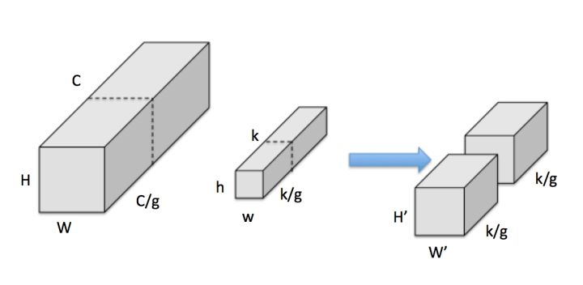

[参考](https://zhuanlan.zhihu.com/p/35405071)


### 33、AP、mAP计算

多标签图像分类（Multi-label Image Classification）任务中图片的标签不止一个，因此评价不能用普通单标签图像分类的标准，即mean  accuracy，该任务采用的是和信息检索中类似的方法——**mAP（mean Average Precision）**。

mAP虽然字面意思和mean  accuracy看起来差不多，但是计算方法要繁琐得多，以下是mAP的计算方法：

首先用训练好的模型得到所有测试样本的confidence  score，每一类（如car）的confidence   score保存到一个文件中（如comp1_cls_test_car.txt）。假设共有20个测试样本，每个的id，confidence  score和ground  truth  label如下：​​

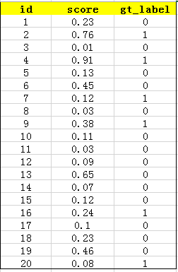

接下来对confidence  score排序，得到：

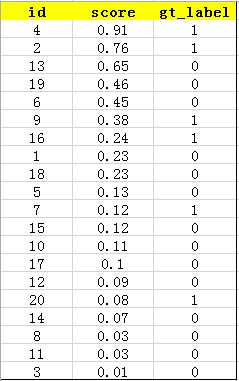

然后计算precision和recall，这两个标准的定义如下：

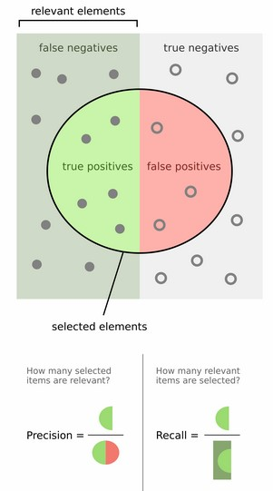

上图比较直观，圆圈内（true   positives + false  positives）是我们选出的元素,它对应于分类任务中我们取出的结果，比如对测试样本在训练好的car模型上分类，我们想得到**top-5**的结果，即：

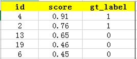

在这个例子中，true   positives就是指第4和第2张图片，false   positives就是指第13，19，6张图片。方框内圆圈外的元素（false   negatives和true  negatives）是相对于方框内的元素而言，在这个例子中，是指confidence   score排在top-5之外的元素，即：

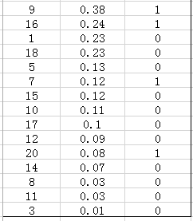


其中，false   negatives是指第9，16，7，20张图片，true   negatives是指第1,18,5,15,10,17,12,14,8,11,3张图片。

那么，这个例子中Precision=2/5=40%，意思是对于car这一类别，我们选定了5个样本，其中正确的有2个，即准确率为40%；Recall=2/6=30%，意思是在所有测试样本中，共有6个car，但是因为我们只召回了2个，所以召回率为30%。


实际多类别分类任务中，我们通常不满足只通过top-5来衡量一个模型的好坏，而是需要知道从top-1到top-N（N是所有测试样本个数，本文中为20）对应的precision和recall。显然随着我们选定的样本越来也多，recall一定会越来越高，而precision整体上会呈下降趋势。把recall当成横坐标，precision当成纵坐标，即可得到常用的precision-recall曲线。这个例子的precision-recall曲线如下：

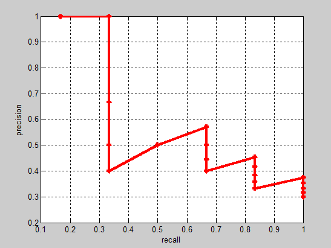

接下来说说AP的计算，此处参考的是PASCAL  VOC  CHALLENGE的计算方法。首先设定一组阈值，[0, 0.1, 0.2, …, 1]。然后对于recall大于每一个阈值（比如recall>0.3），我们都会得到一个对应的最大precision。这样，我们就计算出了11个precision。AP即为这11个precision的平均值。这种方法英文叫做11-point interpolated average precision。​


当然PASCAL VOC CHALLENGE自2010年后就换了另一种计算方法。新的计算方法假设这N个样本中有M个正例，那么我们会得到**M个recall值**（1/M, 2/M, …, M/M）,**对于每个recall值r**，**我们可以计算出对应**（r’ > r）**的最大precision**，**然后对这M个precision值取平均即得到最后的AP值**。计算方法如下：​

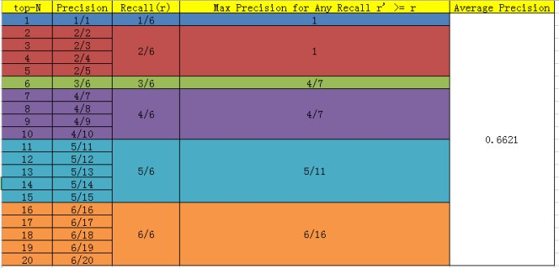

AP衡量的是学出来的模型在每个类别上的好坏，mAP衡量的是学出的模型在所有类别上的好坏，得到AP后mAP的计算就变得很简单了，就是**取所有AP的平均值**

### 36、InceptionNet

#### 1、Inception V1如何降低参数量的？

- 用全局平均池化层代替了全连接（VGG中全连接层的参数占据了90%的参数量）

- 大量1×1的卷积核的使用

#### 2、Inception Net设计的思考是什么？(好的深度网络有哪些设计原则)

- **逐层构造网络**：如果数据集的概率分布能够被一个神经网络所表达，那么构造这个网络的最佳方法是逐层构筑网络，即将上一层高度相关的节点连接在一起。几乎所有效果好的深度网络都具有这一点，不管AlexNet VGG堆叠多个卷积，googleNet堆叠多个inception模块，还是ResNet堆叠多个resblock。

- **稀疏的结构**：人脑的神经元连接就是稀疏的，因此大型神经网络的合理连接方式也应该是稀疏的。稀疏的结构对于大型神经网络至关重要，可以减轻计算量并减少过拟合。 卷积操作（局部连接，权值共享）本身就是一种稀疏的结构，相比于全连接网络结构是很稀疏的。

- **符合Hebbian原理**: Cells that fire together, wire together. 一起发射的神经元会连在一起。 相关性高的节点应该被连接而在一起。

inception中 1×1的卷积恰好可以融合三者。我们一层可能会有多个卷积核，在同一个位置但在不同通道的卷积核输出结果相关性极高。一个1×1的卷积核可以很自然的把这些相关性很高，在同一个空间位置，但不同通道的特征结合起来。而其它尺寸的卷积核（3×3，5×5）可以保证特征的多样性，因此也可以适量使用。于是，这就完成了inception module下图的设计初衷：4个分支：

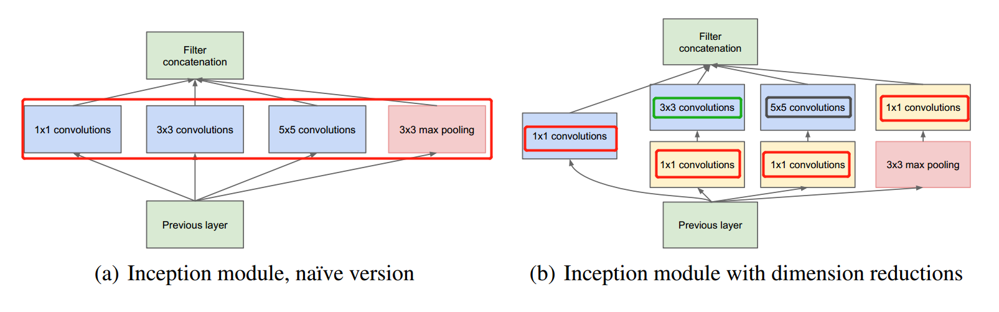

#### 3、Inception如何减少参数量的？

- 1×1的卷积核和正常的滤波器完全是一样的，只不过它不再感受一个局部区域，不考虑像素与像素之间的关系。1×1的卷积本身就是不同feature channel的线性叠加。1×1的卷积最早出现在Network in Network这篇文章中，在Google的inception结构中也采用了大量1×1的卷积。

- NIN论文中解释1×1的卷积实现了多个feature map的结合，从而整合了不同通道间的信息。（个人认为这个作用并不是特点，因为其它大小的卷积核也可以实现）

- 1×1的卷积可以实现通道数量的升维和降维。并且是低成本的特征变换（计算量比3×3小很多）。是一个性价比很高的聚合操作。怎么理解1×1是性价比很高的升降通道数的操作呢？
<br>

（以google inception为例）
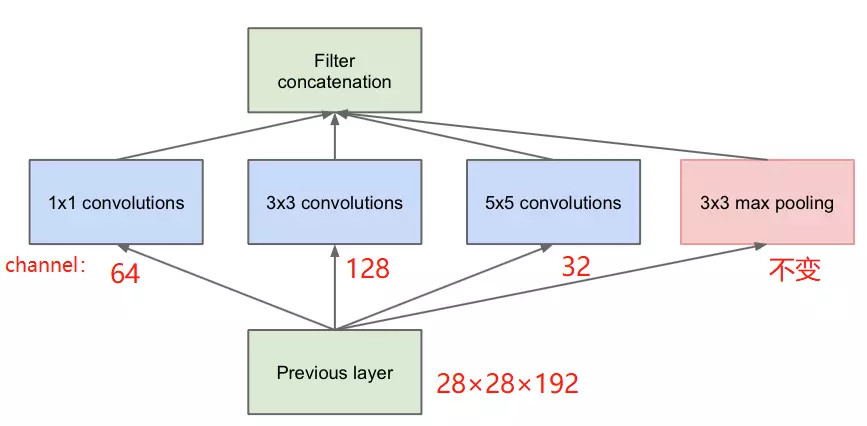

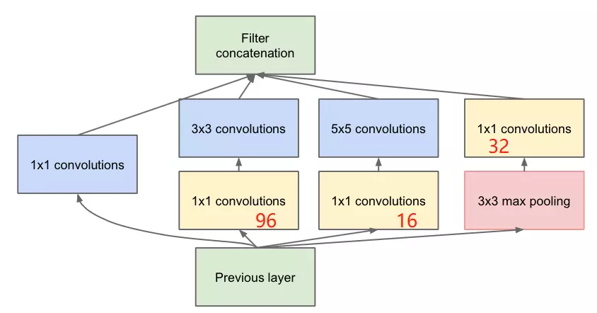

**原始结构：**

- 参数：

$$
(1 \times 1 \times 192 \times 64)+(3 \times 3 \times 192 \times 128)+(5 \times 5 \times 192 \times 32)=153600
$$

- 最终输出的feature map:

$$
64+128+32+192=416
$$

**加入不同channel的1×1卷积后：**

- 参数:

$$
1 \times 1 \times 192 \times 64+(1 \times 1 \times 192 \times 96+3 \times 3 \times 96 \times 128)+(1 \times 1 \times 192 \times 16+5 \times 5 \times 16 \times 32)=15872
$$

- 最终输出的feature map：

$$
64+128+32+32=256
$$

所以加入1×1的卷积后，在降低大量运算的前提下，降低了维度。降低维度也是inception module一个非常明智的举措。

<br>
### 前沿

#### RefineDet

[参考](https://www.cnblogs.com/hellcat/p/10357220.html#_label0)

#### Cascade R-CNN

[参考](https://blog.csdn.net/qq_21949357/article/details/80046867)

#### Bottlenet layer
[参考](https://blog.csdn.net/zqnnn/article/details/88241852)

### 37、TensorRT原理

